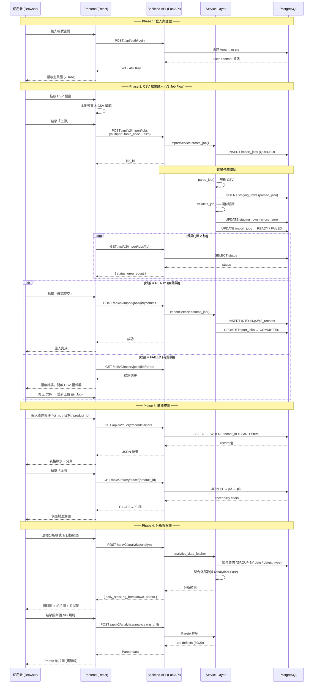

# Form Analysis Spec Kit

表單分析規格套件 - 一個用於處理和分析表單資料的完整系統。

---

## 初學者指南 (推薦)

如果是第一次接觸本專案，或不熟悉前後端開發環境，請**務必使用此模式**。

### 1. 前置準備
請先下載並安裝 **Docker Desktop**：
- [下載 Docker Desktop for Windows](https://www.docker.com/products/docker-desktop/)
- 安裝完成後，請啟動 Docker Desktop 並確保左下角顯示綠色的 "Engine running"。

### 2. 啟動系統
雙擊執行以下腳本：
```bash
.\scripts\start-system.bat
```
*(若出現 Windows 安全性警示，請點選「仍要執行」)*

### 3. 等待啟動
- 系統會自動下載所需元件並建立資料庫，首次啟動約需 **3-5 分鐘**。
- 當看到瀏覽器自動開啟並顯示登入畫面時，代表啟動成功！

### 4. 登入 / 初始化（Tenant + API key）

第一次啟動後，請到前端 `http://localhost:18003` 依序完成「初始化 → 登入」：

- 「初始化」：第一次建立 Tenant / 建立 Tenant manager（需要 admin key，通常由內部維運操作）
- 「登入」：選擇 Tenant、用帳密登入取得 API key（若後端啟用 `AUTH_MODE=api_key`）
- （可選）「管理者」：日常 CRUD（Tenant / Tenant users）

- 空資料庫：先到「初始化」貼上 admin key → 建立/選擇 Tenant → 建立第一個 tenant manager
- 有 tenant：到「登入」選擇 Tenant → 帳密登入取得 API key

完整流程與常見問題：getting-started/REGISTRATION_FLOW.md

（工程師補充）多租戶與管理者端點/權限摘要：dev-guides/TENANT_INIT_ADMIN_GUIDE.md

---

## 開發者指南 (本地模式)

適合需要修改程式碼或進行除錯的開發人員。

### 1. 環境需求
- **Python 3.8+**: [下載 Python](https://www.python.org/downloads/)
- **Node.js 18+**: [下載 Node.js](https://nodejs.org/)
- **PostgreSQL 16+**: [下載 PostgreSQL](https://www.postgresql.org/download/)
  - 安裝時請記住密碼，並建立一個名為 `form_analysis` 的資料庫。
  - 預設端口需設為 `18001` (或修改 `.env` 設定)。

### 2. 首次安裝 (First Time Setup)
在執行啟動腳本前，請先開啟終端機 (Terminal) 執行以下指令安裝依賴：

**步驟 A: 設定後端**
```bash
cd form-analysis-server/backend
python -m venv venv
.\venv\Scripts\activate
pip install -r requirements.txt
cp .env.example .env
```

**步驟 B: 設定前端**
```bash
cd ../frontend
npm install
```

### 3. 啟動服務
完成上述安裝後，雙擊執行：
```bash
.\scripts\start_services.bat
```

---

## 常用指令與監控

### 系統操作
| 動作 | 指令 (Windows) | 說明 |
|------|---------------|------|
| **啟動系統** | `.\scripts\start-system.bat` | Docker 模式啟動 (推薦) |
| **停止系統** | `.\scripts\stop-system.bat` | 停止所有 Docker 服務 |
| **快速重啟** | `.\scripts\start_services.bat` | 本地開發模式啟動 |

### 監控與診斷
| 動作 | 指令 | 說明 |
|------|------|------|
| **後端日誌** | `.\scripts\monitor_backend.bat` | 查看 API 錯誤訊息 |
| **前端日誌** | `.\scripts\monitor_frontend.bat` | 查看網頁錯誤訊息 |
| **系統診斷** | `.\scripts\diagnose-system.bat` | 自動檢查環境問題 |

### 服務存取
- **前端應用**: http://localhost:18003/index.html
- **API 文檔**: http://localhost:18002/docs
- **資料庫**: localhost:18001 (PostgreSQL)

---

## 專案結構

```
Form-analysis-server-specify-kit/
├── README.md                    # 專案說明
├── form-analysis-server/        # 核心程式碼
│   ├── backend/                   # Python FastAPI 後端
│   ├── frontend/                  # React TypeScript 前端
│   └── docker-compose.yml         # Docker 設定檔
├── scripts/                     # 自動化腳本
├── docs/                        # 詳細文件
└── test-data/                   # 測試用 CSV 檔案
```

---

## 系統架構總覽

本平台是一個**製造業表單分析與供應鏈追溯系統**，涵蓋 P1（押出）→ P2（分條）→ P3（沖壓）三階段生產數據的上傳、查詢、分析與追溯。

### 架構泳道圖

```mermaid
flowchart LR
    subgraph User["使用者層"]
        Browser["瀏覽器"]
    end

    subgraph Frontend["前端 React + Vite"]
        direction TB
        Register["RegisterPage<br/>登入"]
        Upload["UploadPage<br/>上傳"]
        Query["QueryPage<br/>查詢"]
        Analytics["AnalyticsPage<br/>分析"]
        Admin["AdminPage<br/>管理"]
    end

    subgraph Backend["後端 FastAPI"]
        direction TB
        MW["Middleware<br/>Auth + Tenant 隔離"]
        Routes["Routes Layer<br/>import_v2 / query_v2 / analytics"]
        Services["Service Layer<br/>ImportService / AnalyticsFetcher"]
        Models["ORM Models<br/>P1/P2/P3 Records"]
    end

    subgraph External["外部系統"]
        AF["Analytical-Four<br/>外部分析數據"]
        PDF["PDF Server<br/>PDF→CSV 轉換"]
    end

    subgraph Database["PostgreSQL 16"]
        direction TB
        BizData["業務表<br/>p1/p2/p3_records"]
        ImportData["匯入表<br/>import_jobs / staging_rows"]
        TenantData["租戶表<br/>tenants / users / keys"]
        AuditData["稽核表<br/>audit_events"]
    end

    Browser --> Frontend
    Frontend -->|HTTP + X-API-Key| MW
    MW --> Routes
    Routes --> Services
    Services --> Models
    Models --> Database
    Services --> External
```



---

## Work Breakdown Structure (WBS)

```mermaid
graph TD
    ROOT["Form Analysis Server<br/>製造業表單分析平台"]

    ROOT --> BE["Backend<br/>FastAPI + Python"]
    ROOT --> FE["Frontend<br/>React + TypeScript"]
    ROOT --> DB["Database<br/>PostgreSQL 16"]
    ROOT --> INFRA["Infrastructure<br/>Docker Compose"]

    BE --> AUTH["認證模組<br/>routes_auth.py"]
    AUTH --> AUTH1["API Key 驗證"]
    AUTH --> AUTH2["Admin 驗證"]
    AUTH --> AUTH3["Tenant 隔離 Middleware"]

    BE --> IMPORT["匯入模組 V2<br/>routes_import_v2.py"]
    IMPORT --> IMP1["CSV/Excel 上傳"]
    IMPORT --> IMP2["解析 parse_job"]
    IMPORT --> IMP3["驗證 validate_job"]
    IMPORT --> IMP4["提交 commit_job"]
    IMPORT --> IMP5["PDF 轉 CSV"]

    BE --> QUERY["查詢模組 V2<br/>api/query_v2/"]
    QUERY --> Q1["Records 查詢"]
    QUERY --> Q2["Lots 查詢"]
    QUERY --> Q3["Dynamic 動態查詢"]
    QUERY --> Q4["追溯鏈查詢 P1→P2→P3"]

    BE --> ANALYTICS["分析模組<br/>api/analytics/"]
    ANALYTICS --> A1["日報/週報分析"]
    ANALYTICS --> A2["NG 不良分析"]
    ANALYTICS --> A3["Pareto 柏拉圖"]
    ANALYTICS --> A4["外部數據整合<br/>Analytical-Four"]

    BE --> TENANT["租戶管理<br/>routes_tenants.py"]
    TENANT --> T1["租戶 CRUD"]
    TENANT --> T2["使用者管理"]
    TENANT --> T3["API Key 管理"]

    BE --> AUDIT["稽核模組<br/>routes_audit_events.py"]

    FE --> PG1["RegisterPage<br/>登入/初始化"]
    FE --> PG2["UploadPage<br/>檔案上傳"]
    FE --> PG3["QueryPage<br/>數據查詢"]
    FE --> PG4["AnalyticsPage<br/>分析儀表板"]
    FE --> PG5["ManagerPage<br/>管理員操作"]
    FE --> PG6["AdminPage<br/>系統管理"]
    FE --> PG7["LogViewer<br/>稽核日誌"]

    PG2 --> PG2A["拖放上傳區"]
    PG2 --> PG2B["CSV 線上編輯器"]
    PG2 --> PG2C["驗證錯誤檢視"]

    PG4 --> PG4A["日期範圍選擇器"]
    PG4 --> PG4B["NG 模式分析"]
    PG4 --> PG4C["Pareto 柏拉圖"]
    PG4 --> PG4D["圓餅圖/柱狀圖"]

    DB --> DB1["業務資料表<br/>p1/p2/p3_records + items"]
    DB --> DB2["匯入狀態表<br/>import_jobs / staging_rows"]
    DB --> DB3["租戶表<br/>tenants / users / api_keys"]
    DB --> DB4["稽核表<br/>audit_events"]
    DB --> DB5["Schema 註冊<br/>table_registry"]
```



---

## 核心流程泳道圖（匯入 → 查詢 → 分析）



---

## 模組摘要表

| 層級 | 模組 | 主要檔案 | 職責 |
|------|------|----------|------|
| **Frontend** | UploadPage | `pages/UploadPage.tsx` | 拖放上傳、CSV 編輯、錯誤修正 |
| | QueryPage | `pages/QueryPage.tsx` | 條件查詢、追溯鏈視覺化 |
| | AnalyticsPage | `pages/AnalyticsPage.tsx` | 日報/NG/Pareto 分析儀表板 |
| **Backend** | Import V2 | `services/import_v2.py` | Job-based 匯入：解析→驗證→提交 |
| | Analytics | `services/analytics_data_fetcher.py` | 聚合分析 + 外部數據整合 |
| | Query V2 | `api/query_v2/` | Records/Lots/Dynamic/追溯查詢 |
| | Auth | `routes_auth.py` + middleware | API Key + 多租戶隔離 |
| **Database** | 業務資料 | `p1/p2/p3_records` | 三階段生產數據（押出→分條→沖壓） |
| | 匯入管理 | `import_jobs` + `staging_rows` | 狀態機：QUEUED→READY→COMMITTED |
| | 多租戶 | `tenants` + `tenant_users` | 租戶隔離 + RBAC（manager/operator） |

## 主要 API 端點

| 類別 | 端點 | 說明 |
|------|------|------|
| **匯入** | `POST /api/v2/import/jobs` | 建立匯入 Job（上傳 CSV） |
| | `GET /api/v2/import/jobs/{id}` | 查詢 Job 狀態 |
| | `POST /api/v2/import/jobs/{id}/commit` | 確認提交 |
| **查詢** | `GET /api/v2/query/records` | 依條件查詢記錄 |
| | `GET /api/v2/query/lots/{lot_no}` | 查詢 Lot 詳情 |
| | `GET /api/v2/query/trace/{product_id}` | 供應鏈追溯 |
| **分析** | `POST /api/v2/analytics/analyze` | 執行分析（日報/週報/NG） |
| | `GET /api/v2/analytics/artifacts` | 取得分析產物 |
| **認證** | `POST /api/auth/login` | 使用者登入 |
| | `POST /api/tenants` | 建立租戶（Admin） |
| **健康檢查** | `GET /healthz` | 基本健康檢查 |

---

## 進階文件

- [產品需求文檔 (PRD)](docs/PRD2.md)
- [手動啟動指南](docs/MANUAL_STARTUP_GUIDE.md)
- [日誌管理工具](docs/LOG_MANAGEMENT_TOOLS.md)
- [DBeaver 資料庫連線指南](docs/DBEAVER_CONNECTION_GUIDE.md)

---

**最後更新**: 2026年3月22日
