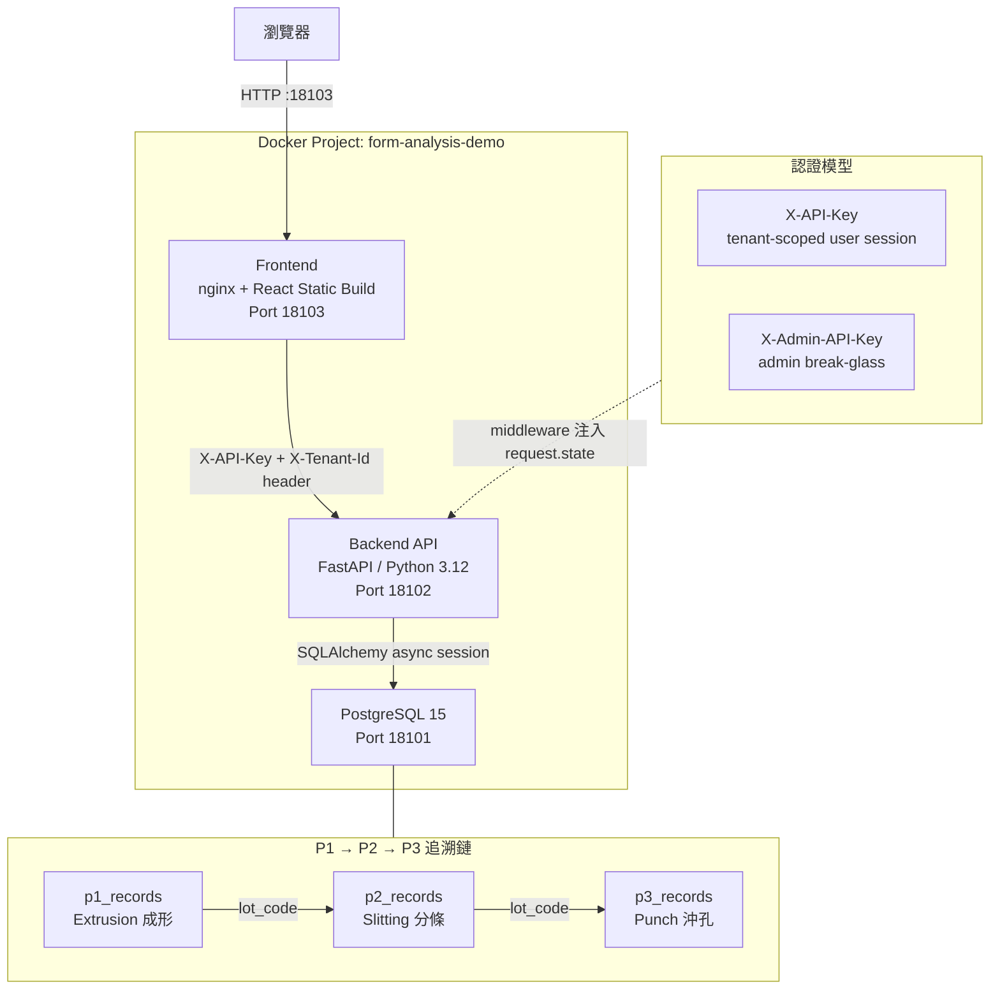
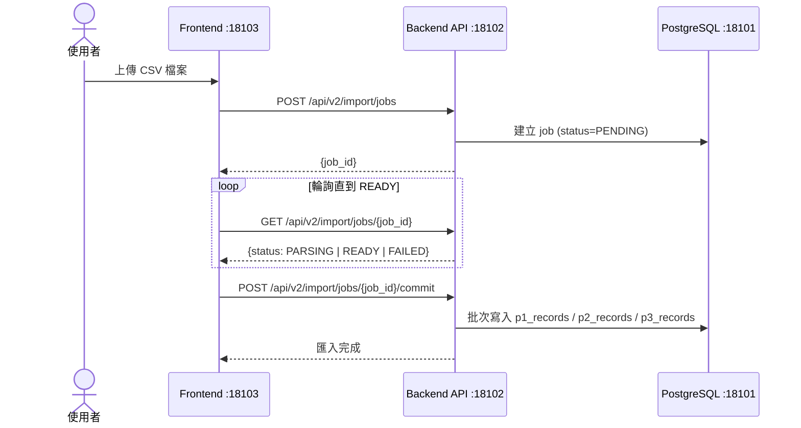

# Form Analysis Server — Specify Kit

表單資料分析系統，支援 P1/P2/P3 製程追溯、CSV 資料匯入、NG Pareto 分析，以 Docker 多租戶架構部署。

---

## 環境一覽

| 環境 | 用途 | Frontend | API | DB |
|------|------|----------|-----|-----|
| **Demo** | 展示 / 驗收 | http://127.0.0.1:18103 | :18102 | :18101 |
| **Dev** | 開發 / 除錯 | http://127.0.0.1:18003 | :18002 | :18001 |

> 所有 URL 使用 `127.0.0.1`，勿用 `localhost`（Windows IPv6 問題）

---

## 快速啟動

### Demo 環境（展示用）

```powershell
cd scripts
.\start-demo.bat
```

啟動後自動建立 demo tenant 與預設帳號。開啟 http://127.0.0.1:18103 登入。

```powershell
# 停止
.\stop-demo.bat
```

### Dev 環境（開發用）

```powershell
cd scripts
.\start-dev.bat
```

```powershell
# 停止
.\stop-system.bat
```

---

## 預設帳號

> **⚠️ 重要**：前端登入頁「**區域代碼（可留空）**」欄位，Demo 環境**必須填入 `demo`**

| 環境 | 區域代碼 | 帳號 | 密碼 | 角色 |
|------|----------|------|------|------|
| Demo | `demo` | `demo_manager` | `DemoManager123!` | Manager |
| Demo | `demo` | `demo_user` | `DemoUser123!` | User |

---

## 系統架構



### 資料匯入流程（V2 Import Job）



---

## 主要功能

| 頁面 | 功能 | API |
|------|------|-----|
| 登入 | 多租戶帳號登入 | `POST /api/auth/login` |
| 上傳 | CSV/Excel 匯入（含驗證、錯誤回報） | `POST /api/v2/import/jobs` |
| 查詢 | P1/P2/P3 跨製程追溯查詢 | `GET /api/v2/query` |
| 分析 | Daily NG Pareto Chart | `GET /api/analytics` |
| 管理 | 租戶與使用者管理（Manager/Admin） | `GET/POST /api/tenants` |

---

## 將 Dev 代碼同步到 Demo

```powershell
cd scripts
.\build-demo-images.bat   # 重建 production image（代碼打包入 image）
.\start-demo.bat          # 重啟 Demo 環境
```

| 情況 | 是否需要重建 |
|------|-------------|
| 修改 backend / frontend 代碼 | ✅ 需要 `build-demo-images.bat` |
| 修改 Dockerfile / requirements.txt / package.json | ✅ 需要 |
| 只是重啟（代碼未變） | ❌ 直接 `start-demo.bat` |
| 只改 `.env.demo` 環境變數 | ❌ 直接 `start-demo.bat` |

---

## 技術棧

| 層次 | 技術 |
|------|------|
| Frontend | React 18 + TypeScript + Vite + Tailwind CSS + shadcn/ui |
| Backend | FastAPI + SQLAlchemy 2.0 async + Python 3.12 |
| Database | PostgreSQL 15 |
| 容器 | Docker Desktop + docker-compose |
| i18n | react-i18next（zh-TW / en） |

---

## 啟動前確認

- [ ] Docker Desktop 正在執行
- [ ] `.env.demo` 中 `SEPTEMBER_V2_HOST_PATH` / `ANALYTICAL_FOUR_HOST_PATH` 已填寫
- [ ] Port 18101 / 18102 / 18103 未被其他服務佔用

---

## 相關文件

- [Demo 展示指南](README_DEMO.md)
- [開發者指南](README_DEV.md)
- [腳本清單](scripts/SCRIPTS_INVENTORY.md)
- [AI Agent 開發規範](CLAUDE.md)
