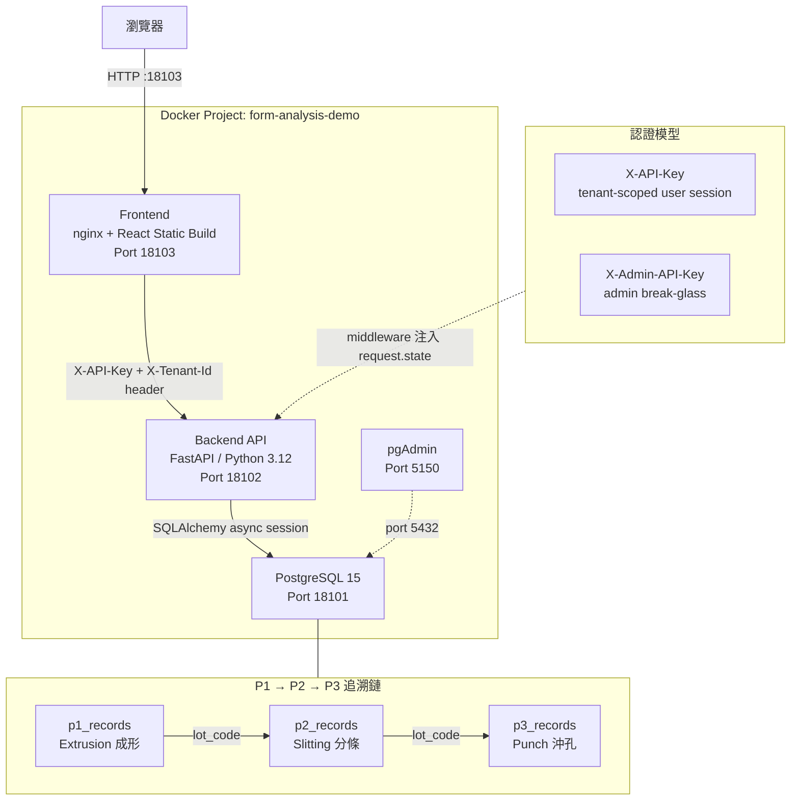
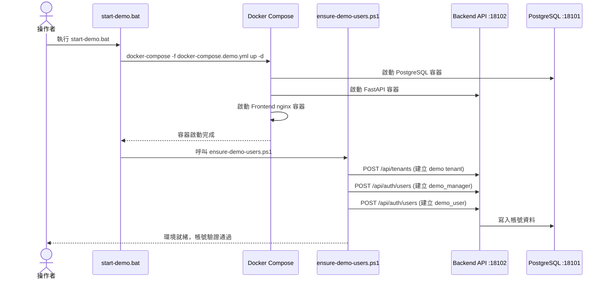
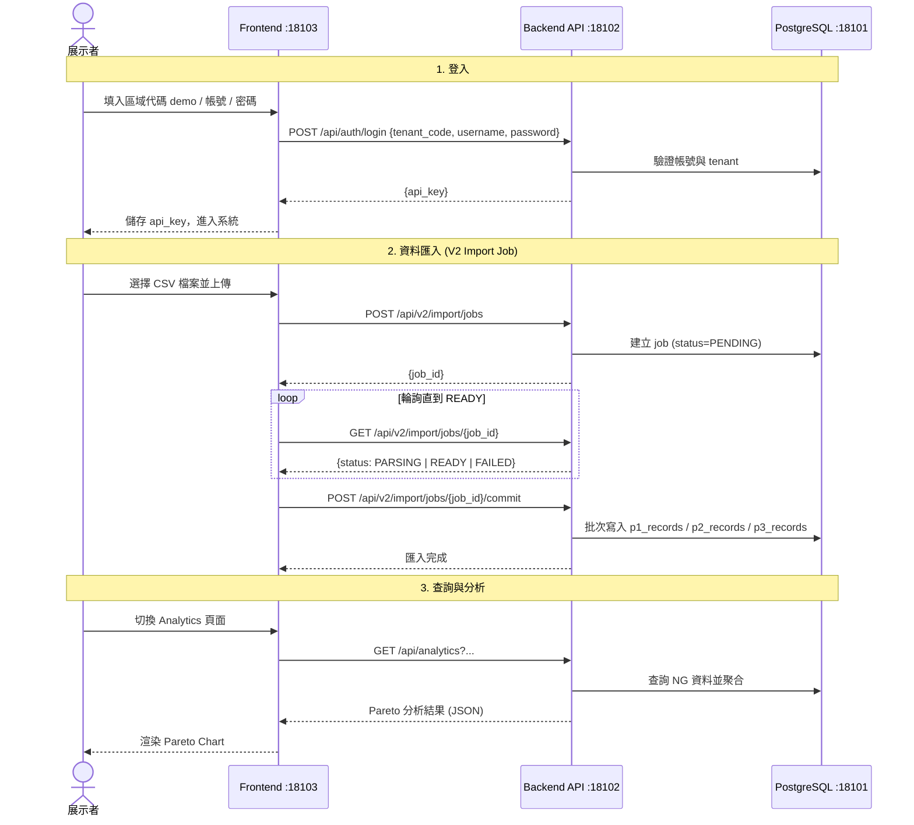
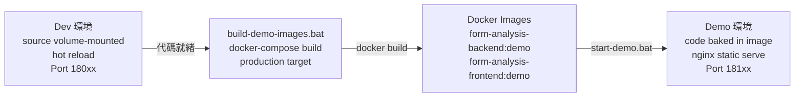

# README_DEMO — Form Analysis Server Demo Guide

> 最後更新：2026-03-22

---

## Demo 環境架構總覽



---

## Demo 操作泳道圖

### 環境啟動流程



### 展示操作流程



---

## 快速啟動

### Demo 環境

```powershell
cd scripts
.\start-demo.bat
```

| 服務     | URL                          |
|----------|------------------------------|
| Frontend | http://127.0.0.1:18103       |
| API      | http://127.0.0.1:18102       |
| DB Port  | 18101                        |
| pgAdmin  | http://127.0.0.1:5150        |

```powershell
cd scripts
.\stop-demo.bat
```

---

## 預設帳號

### Demo 環境

| 欄位           | Manager        | User         |
|----------------|----------------|--------------|
| 區域代碼       | `demo`         | `demo`       |
| 帳號           | demo_manager   | demo_user    |
| 密碼           | DemoManager123! | DemoUser123! |

> **⚠️ 注意**：前端登入頁面有「**區域代碼（可留空）**」欄位，Demo 環境**必須填入 `demo`**，否則會出現登入失敗。

### 前端登入步驟

1. 開啟 http://127.0.0.1:18103
2. 在「**區域代碼（可留空）**」欄填入：`demo`
3. 帳號填入：`demo_manager`
4. 密碼填入：`DemoManager123!`
5. 點擊登入

---

## 環境隔離架構

```
┌─────────────────────────────────────────────────────────────┐
│                    Docker Desktop                            │
├─────────────────────────────┬───────────────────────────────┤
│     Demo Environment        │      Dev Environment          │
│     -p form-analysis-demo   │      -p form-analysis-dev     │
├─────────────────────────────┼───────────────────────────────┤
│  demo_form_analysis_db      │  form_analysis_db             │
│  (Port 18101)               │  (Port 18001)                 │
├─────────────────────────────┼───────────────────────────────┤
│  demo_form_analysis_api     │  form_analysis_api            │
│  (Port 18102)               │  (Port 18002)                 │
├─────────────────────────────┼───────────────────────────────┤
│  demo_form_analysis_frontend│  form_analysis_frontend       │
│  (Port 18103)               │  (Port 18003)                 │
├─────────────────────────────┼───────────────────────────────┤
│  Volume: postgres_demo_data │  Volume: postgres_data        │
└─────────────────────────────┴───────────────────────────────┘
```

---

## 重要檔案位置

| 類別           | 檔案路徑                                                     |
|----------------|--------------------------------------------------------------|
| Demo Compose   | `form-analysis-server/docker-compose.demo.yml`              |
| Dev Compose    | `form-analysis-server/docker-compose.yml`                   |
| Demo 環境變數  | `form-analysis-server/.env.demo`                            |
| Dev 環境變數   | `form-analysis-server/.env.dev`                             |
| 啟動腳本       | `scripts/start-demo.bat`, `scripts/stop-demo.bat`           |
| 帳號確保腳本   | `scripts/ensure-demo-users.ps1`                             |
| 腳本清單       | `scripts/SCRIPTS_INVENTORY.md`                              |

---

## Smoke Test 清單

| 測試案例 | 說明                                      | 狀態 |
|----------|-------------------------------------------|------|
| TC01     | Manager 登入成功                          | PASS |
| TC02     | 登入失敗處理                              | PASS |
| TC03     | 上傳流程基本檢查                          | PASS |
| TC04     | Analytical Four 單一產品查詢              | PASS |
| TC05     | 多產品查詢與 Rate Limit 行為              | PASS |
| TC06     | Query 頁面動態篩選                        | PASS |
| TC07     | Query Table 欄位對應                      | PASS |
| TC08     | Manager 權限工作流程                      | PASS |
| TC09     | 日期範圍查詢 2025-08-01 ~ 2025-09-30      | PASS |

> 完整測試文件：[SMOKE_TEST_DEMO.md](SMOKE_TEST_DEMO.md)
> 測試結果紀錄：[SMOKE_TEST_DEMO_RESULT_20260223.md](SMOKE_TEST_DEMO_RESULT_20260223.md)

---

## Demo 套件建置里程碑

| 步驟 | 說明                              | 狀態       |
|------|-----------------------------------|------------|
| S1   | Demo branch 建立 `demo/20260223`  | ✅ 完成    |
| S2   | Demo env template `.env.demo`     | ✅ 完成    |
| S3   | Smoke test 文件建立               | ✅ 完成    |
| S4   | 一鍵啟動腳本 `start-demo.bat`     | ✅ 完成    |
| S5   | Smoke test 執行 & 結果記錄        | ✅ 通過    |
| S6   | Demo 凍結 & 交接文件              | ✅ 完成    |

---

## 啟動前確認清單

在正式展示前，請確認以下項目：

- [ ] `form-analysis-server/.env.demo` 中的 `SEPTEMBER_V2_HOST_PATH` 已填寫正確路徑
- [ ] `form-analysis-server/.env.demo` 中的 `ANALYTICAL_FOUR_HOST_PATH` 已填寫正確路徑
- [ ] `POSTGRES_PASSWORD`、`SECRET_KEY`、`ADMIN_API_KEYS` 已替換為強密碼（非預設值）
- [ ] Docker Desktop 正在執行
- [ ] 18101、18102、18103 port 未被其他服務佔用

---

## 將 Dev 代碼更新到 Demo 映像

當 Dev 環境的功能開發完成，需要同步到 Demo 展示環境時，執行以下步驟：

### 流程概覽



### 操作步驟

**Step 1 — 確認 Dev 環境代碼已就緒**

在 Dev 環境完成開發與測試（http://127.0.0.1:18003），確認功能正確後繼續。

**Step 2 — 建立 Demo 映像（將代碼打包進 image）**

```powershell
cd scripts
.\build-demo-images.bat
```

此腳本會執行：

| 階段    | 動作                                                                                      |
|---------|-------------------------------------------------------------------------------------------|
| [1/3]   | 建立 backend image：`docker-compose -p form-analysis-demo -f docker-compose.demo.yml build backend` |
| [2/3]   | 建立 frontend image：`docker-compose -p form-analysis-demo -f docker-compose.demo.yml build frontend` |
| [3/3]   | 驗證 image 是否存在：`docker images | findstr "form-analysis"`                            |

建立完成後產生兩個 image：
- `form-analysis-backend:demo`
- `form-analysis-frontend:demo`

> **與 Dev 的差異**：Dev 環境使用 `development` target，source code 以 volume 掛載（支援 hot reload）；Demo 使用 `production` target，代碼直接打包進 image，無 hot reload。

**Step 3 — 啟動 Demo 環境**

```powershell
.\start-demo.bat
```

Demo 環境會使用剛才建立的 image 啟動，並自動確保 demo 帳號存在。

**Step 4 — 驗證**

```powershell
docker images | findstr "form-analysis"
docker ps --format "table {{.Names}}\t{{.Status}}\t{{.Ports}}"
```

前往 http://127.0.0.1:18103 確認功能正確。

---

### 何時需要重新執行 `build-demo-images.bat`

| 情況                              | 是否需要重建 |
|-----------------------------------|--------------|
| 修改了 backend 代碼               | ✅ 需要      |
| 修改了 frontend 代碼              | ✅ 需要      |
| 修改了 Dockerfile                 | ✅ 需要      |
| 更新了 `requirements.txt` / `package.json` | ✅ 需要 |
| 只是重新啟動 Demo（代碼未變）     | ❌ 不需要，直接 `start-demo.bat` |
| 修改了 `.env.demo` 環境變數       | ❌ 不需要，重新 `start-demo.bat` 即可 |

---

### 前置條件

在執行 `build-demo-images.bat` 前，確認：
- `form-analysis-server/docker-compose.demo.yml` 存在
- `form-analysis-server/.env.demo` 存在且已填入正確路徑
- Docker Desktop 正在執行

---

## 常見操作

### 重建 Demo 映像

```powershell
cd scripts
.\build-demo-images.bat
```

### 查看容器狀態

```powershell
docker ps --format "table {{.Names}}\t{{.Status}}\t{{.Ports}}"
```

### 查看 API 日誌

```powershell
docker logs demo_form_analysis_api -f
```

---

## AI Agent 開發注意事項

1. **IPv4 Only**：所有 URL 使用 `127.0.0.1` 而非 `localhost`（避免 IPv6 問題）
2. **環境隔離**：Demo 和 Dev 使用不同的 Docker project name，互不影響
3. **資料庫分離**：兩套環境使用獨立的 PostgreSQL volume
4. **Port 規則**：Demo `181xx`，Dev `180xx`
5. **PDF 服務**：需設定 `PDF_SERVER_URL` 環境變數才能使用 PDF 轉檔功能

---

## 相關文件

- [環境分離操作指南](dev-guides/ENV_SEPARATION_OPERATIONS_GUIDE.md)
- [雙環境啟動檢查清單](dev-guides/DUAL_ENV_STARTUP_CHECKLIST.md)
- [固定測試資料規格](dev-guides/DEMO_FIXED_TEST_DATA_AUG_SEP.md)
- [Demo 凍結紀錄](dev-guides/DEMO_FREEZE_20260223.md)
- [腳本清單](scripts/SCRIPTS_INVENTORY.md)
- [開發者指南](README_DEV.md)
