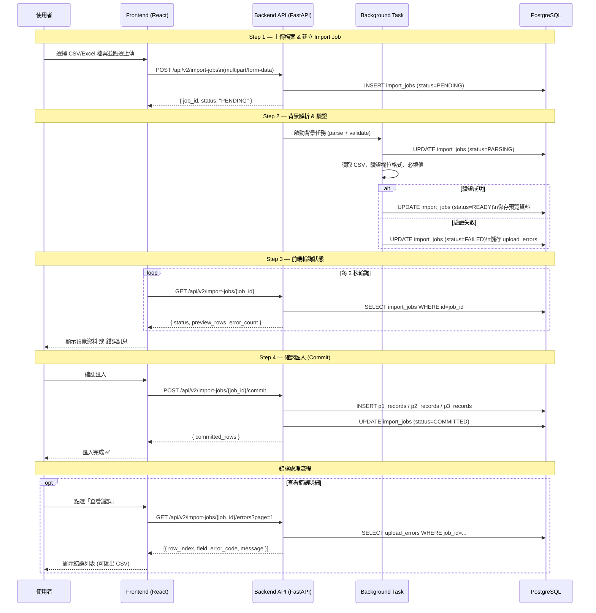
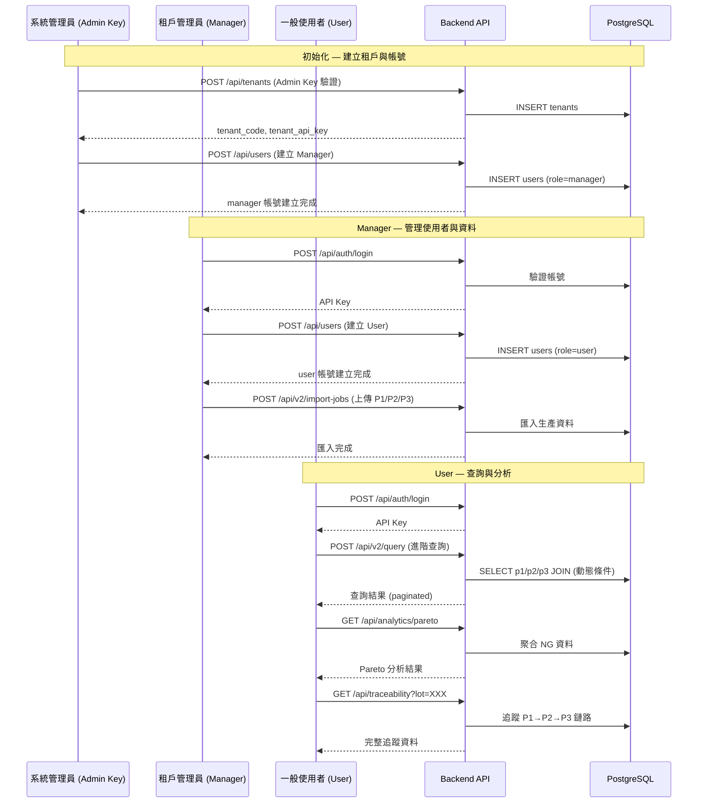

# README_DEV — Form Analysis Server 開發者指南

> 最後更新：2026-03-22

---

## 系統架構 Breakdown

```mermaid
graph TD
    ROOT["Form Analysis Server"]

    ROOT --> FE["Frontend\nReact 18 + TypeScript + Vite"]
    ROOT --> BE["Backend\nFastAPI + Python 3.12"]
    ROOT --> DB["Database\nPostgreSQL 16"]
    ROOT --> INFRA["Infrastructure\nDocker Compose"]

    FE --> FE_PAGES["Pages"]
    FE --> FE_COMP["Components"]
    FE --> FE_SVC["Services"]
    FE --> FE_UI["UI Library (shadcn/ui)"]

    FE_PAGES --> P_UPLOAD["UploadPage\n(CSV/Excel 上傳)"]
    FE_PAGES --> P_QUERY["QueryPage\n(進階查詢)"]
    FE_PAGES --> P_ANALYTICS["AnalyticsPage\n(Pareto 分析)"]
    FE_PAGES --> P_MANAGER["ManagerPage\n(租戶管理)"]
    FE_PAGES --> P_ADMIN["AdminPage\n(系統管理)"]

    FE_COMP --> C_FILEUPLOAD["FileUpload"]
    FE_COMP --> C_PARETO["ParetoChart\n(Recharts)"]
    FE_COMP --> C_TRACE["TraceabilityFlow\n(P1→P2→P3)"]
    FE_COMP --> C_QUERY["DataQuery / AdvancedSearch"]

    FE_SVC --> SVC_API["api.ts (Axios)"]
    FE_SVC --> SVC_AUTH["auth.ts"]
    FE_SVC --> SVC_ANALYTICS["analyticsArtifacts.ts"]

    BE --> BE_ROUTES["API Routes"]
    BE --> BE_MODELS["Database Models"]
    BE --> BE_SERVICES["Business Services"]
    BE --> BE_CORE["Core Infrastructure"]

    BE_ROUTES --> R_IMPORT["routes_import_v2.py\n(V2 Import Jobs)"]
    BE_ROUTES --> R_QUERY["routes_query_v2.py\n(進階查詢)"]
    BE_ROUTES --> R_ANALYTICS["routes_analytics.py\n(Analytics)"]
    BE_ROUTES --> R_AUTH["routes_auth.py\n(登入/登出)"]
    BE_ROUTES --> R_TENANTS["routes_tenants.py\n(多租戶)"]
    BE_ROUTES --> R_EXPORT["routes_export.py\n(資料匯出)"]

    BE_MODELS --> M_P1["p1_record.py\n(押出資料)"]
    BE_MODELS --> M_P2["p2_record.py + p2_item.py\n(切割資料)"]
    BE_MODELS --> M_P3["p3_record.py + p3_item.py\n(打孔資料)"]
    BE_MODELS --> M_IMPORT["import_job.py\n(匯入任務)"]
    BE_MODELS --> M_TENANT["tenant.py\n(租戶)"]
    BE_MODELS --> M_AUDIT["audit.py\n(稽核紀錄)"]

    BE_CORE --> CORE_DB["database.py\n(SQLAlchemy async)"]
    BE_CORE --> CORE_AUTH["auth.py\n(API Key 驗證)"]
    BE_CORE --> CORE_LOG["logging.py\n(structlog)"]
    BE_CORE --> CORE_CFG["config.py\n(Pydantic Settings)"]

    DB --> T_P1["p1_records"]
    DB --> T_P2["p2_records / p2_items"]
    DB --> T_P3["p3_records / p3_items"]
    DB --> T_JOBS["import_jobs"]
    DB --> T_TENANT["tenants / tenant_api_keys"]
    DB --> T_AUDIT["audit_events"]

    INFRA --> DC_DEV["docker-compose.yml\n(Dev 180xx)"]
    INFRA --> DC_DEMO["docker-compose.demo.yml\n(Demo 181xx)"]
    INFRA --> ENV_DEV[".env.dev"]
    INFRA --> ENV_DEMO[".env.demo"]
```



---

## V2 匯入流程泳道圖



---

## 使用者角色與功能泳道圖



---

## 快速啟動（Dev 環境）

```powershell
# 啟動 Dev 環境
cd scripts
.\start-dev.bat

# 停止 Dev 環境
.\stop-system.bat
```

| 服務     | URL                          |
|----------|------------------------------|
| Frontend | http://127.0.0.1:18003       |
| API      | http://127.0.0.1:18002       |
| DB Port  | 18001                        |
| pgAdmin  | http://127.0.0.1:18004       |

---

## 預設帳號

> 密碼以 `.env.demo` / `.env.dev` 為準，以下為實測驗證結果。

### Demo 環境（Port 181xx）

| 角色    | 帳號           | 密碼              | 租戶代碼 | 登入測試 |
|---------|----------------|-------------------|----------|----------|
| Manager | demo_manager   | DemoManager123!   | demo     | ✅ 通過  |
| User    | demo_user      | DemoUser123!      | demo     | ✅ 通過  |

### Dev 環境（Port 180xx）

| 角色    | 帳號           | 密碼              | 租戶代碼 | 登入測試 |
|---------|----------------|-------------------|----------|----------|
| Manager | demo_manager   | DemoManager123!   | default  | ✅ 通過  |

> Dev 環境帳號需手動建立，無固定預設腳本。帳號以實際 DB 內容為準（`tenant_users` 表）。

### 登入方式

```bash
# Demo 環境
curl -X POST http://127.0.0.1:18102/api/auth/login \
  -H "Content-Type: application/json" \
  -d '{"tenant_code":"demo","username":"demo_manager","password":"DemoManager123!"}'

# Dev 環境（tenant_code 可省略，系統自動解析唯一租戶）
curl -X POST http://127.0.0.1:18002/api/auth/login \
  -H "Content-Type: application/json" \
  -d '{"username":"demo_manager","password":"DemoManager123!"}'
```

---

## 技術棧

### Frontend

| 技術             | 版本   | 用途                    |
|------------------|--------|-------------------------|
| React            | 18.2   | UI 框架                 |
| TypeScript       | 5.3    | 型別安全                |
| Vite             | 4.5    | 建置工具                |
| Radix UI         | 1.2+   | Headless UI 元件        |
| shadcn/ui        | -      | 預建 UI 元件庫          |
| Tailwind CSS     | 3.3    | 樣式                    |
| Recharts         | 3.6    | 圖表 (Pareto Chart)     |
| Axios            | 1.5    | HTTP Client             |
| react-hook-form  | 7.7    | 表單管理                |
| react-router-dom | 6.17   | 路由                    |
| i18next          | 23.16  | 多語系                  |
| Vitest           | 0.34   | 測試框架                |

### Backend

| 技術         | 版本   | 用途                         |
|--------------|--------|------------------------------|
| FastAPI      | 0.104+ | API 框架                     |
| Python       | 3.12+  | 程式語言                     |
| SQLAlchemy   | 2.0    | ORM (async)                  |
| Alembic      | 1.13+  | 資料庫 Migration             |
| Pydantic     | 2.5+   | 資料驗證 & Settings          |
| asyncpg      | -      | PostgreSQL 非同步驅動        |
| pandas       | 2.1    | CSV/Excel 讀取與驗證         |
| structlog    | 24.4   | 結構化日誌                   |
| httpx        | 0.25   | 非同步 HTTP Client           |
| Uvicorn      | 0.24+  | ASGI Server                  |

### Infrastructure

| 技術             | 用途                          |
|------------------|-------------------------------|
| Docker           | 容器化                        |
| Docker Compose   | 多服務編排                    |
| PostgreSQL 16    | 主資料庫                      |
| pgAdmin          | 資料庫管理介面                |

---

## 資料夾結構

```
Form-analysis-server-specify-kit/
├── form-analysis-server/
│   ├── frontend/
│   │   └── src/
│   │       ├── pages/          # 頁面元件
│   │       ├── components/     # 共用元件
│   │       │   ├── analytics/  # Pareto Chart 等
│   │       │   └── ui/         # shadcn/ui 元件
│   │       ├── services/       # API 呼叫層
│   │       ├── hooks/          # Custom Hooks
│   │       └── utils/          # 工具函式
│   ├── backend/
│   │   └── app/
│   │       ├── routes_*.py     # API 路由
│   │       ├── models/         # SQLAlchemy 模型
│   │       ├── services/       # 商業邏輯
│   │       ├── core/           # 基礎設施 (auth, db, config)
│   │       ├── api/            # Pydantic schemas & deps
│   │       └── config/         # 欄位對應設定
│   ├── docker-compose.yml          # Dev compose
│   ├── docker-compose.demo.yml     # Demo compose
│   ├── .env.dev                    # Dev 環境變數
│   └── .env.demo                   # Demo 環境變數
├── dev-guides/                 # 開發指南 (47+ 文件)
├── dev-docs/                   # 開發紀錄歷史
├── getting-started/            # 快速上手文件
├── scripts/                    # 啟動/停止腳本
├── test-data/                  # CSV 測試資料
├── migrations/                 # 資料遷移指南
└── tools/                      # 工具腳本
```

---

## 重要 API 端點

### 認證

| 方法 | 路徑               | 說明              |
|------|--------------------|-------------------|
| POST | `/api/auth/login`  | 使用者登入        |
| POST | `/api/auth/logout` | 登出              |

### V2 匯入 (主要流程)

| 方法 | 路徑                                      | 說明              |
|------|-------------------------------------------|-------------------|
| POST | `/api/v2/import-jobs`                     | 建立匯入任務      |
| GET  | `/api/v2/import-jobs/{id}`                | 查詢任務狀態      |
| POST | `/api/v2/import-jobs/{id}/commit`         | 確認匯入          |
| GET  | `/api/v2/import-jobs/{id}/errors`         | 取得錯誤明細      |

### 查詢

| 方法 | 路徑                  | 說明              |
|------|-----------------------|-------------------|
| POST | `/api/v2/query`       | 進階查詢          |
| GET  | `/api/traceability`   | 追蹤 P1→P2→P3     |

### 分析

| 方法 | 路徑                         | 說明              |
|------|------------------------------|-------------------|
| GET  | `/api/analytics/pareto`      | Pareto NG 分析    |
| GET  | `/api/analytics/artifacts`   | 分析結果查詢      |

### 系統管理

| 方法   | 路徑               | 說明              |
|--------|--------------------|-------------------|
| POST   | `/api/tenants`     | 建立租戶 (Admin)  |
| POST   | `/api/users`       | 建立使用者        |
| GET    | `/api/health`      | 健康檢查          |

---

## 資料庫 Schema 概覽

```
p1_records          押出製程資料
  ↓ lot_no
p2_records          切割製程資料
  └── p2_items      切割子項目
       ↓ lot_no
p3_records          打孔製程資料
  └── p3_items      打孔子項目

import_jobs         匯入任務追蹤
  └── upload_errors 驗證錯誤記錄

tenants             租戶
  └── tenant_api_keys  API 金鑰
  └── users           使用者
      └── audit_events 稽核紀錄
```

> 完整 ERD：[dev-guides/DB_SCHEMA_DIAGRAM.md](dev-guides/DB_SCHEMA_DIAGRAM.md)

---

## 開發工作流程

### 新增 API 端點

1. 在 `backend/app/routes_*.py` 新增路由
2. 在 `backend/app/api/schemas/` 定義 Pydantic schema
3. 在 `backend/app/services/` 實作商業邏輯
4. 在 `backend/app/models/` 新增/修改資料模型
5. 執行 `alembic revision --autogenerate -m "description"` 產生 migration
6. 在 `frontend/src/services/` 新增對應 API 呼叫

### 新增前端頁面

1. 在 `frontend/src/pages/` 新增 `.tsx` 元件
2. 在 `frontend/src/App.tsx` 新增路由
3. 使用 `frontend/src/components/ui/` 的 shadcn/ui 元件
4. 在 `frontend/src/services/` 新增 API 服務函式

### 資料庫 Migration

```powershell
# 進入 backend 容器
docker exec -it form_analysis_api bash

# 產生 migration
alembic revision --autogenerate -m "add new table"

# 執行 migration
alembic upgrade head
```

---

## 常見操作

### 查看 Dev 環境日誌

```powershell
docker logs form_analysis_api -f      # Backend
docker logs form_analysis_frontend -f # Frontend
```

### 強制重建映像

```powershell
docker-compose -f form-analysis-server/docker-compose.yml build --no-cache
```

### 查看容器狀態

```powershell
docker ps --format "table {{.Names}}\t{{.Status}}\t{{.Ports}}"
```

### 進入資料庫

```powershell
docker exec -it form_analysis_db psql -U postgres -d form_analysis
```

---

## Port 對照表

| 服務       | Dev (180xx) | Demo (181xx) |
|------------|-------------|--------------|
| PostgreSQL | 18001       | 18101        |
| API        | 18002       | 18102        |
| Frontend   | 18003       | 18103        |
| pgAdmin    | 18004       | 5150         |

---

## 相關文件

- [Demo 操作指南](README_DEMO.md)
- [快速上手](getting-started/QUICK_START.md)
- [V2 Import Jobs 指南](dev-guides/V2_IMPORT_JOBS_GUIDE.md)
- [DB Schema 圖](dev-guides/DB_SCHEMA_DIAGRAM.md)
- [使用者流程圖](dev-guides/USER_FLOW_DIAGRAMS.md)
- [Data Analysis 指南](dev-guides/DATA_ANALYSIS_GUIDE.md)
- [專案概覽](dev-guides/PROJECT_OVERVIEW.md)
- [腳本清單](scripts/SCRIPTS_INVENTORY.md)
- [環境分離操作指南](dev-guides/ENV_SEPARATION_OPERATIONS_GUIDE.md)
