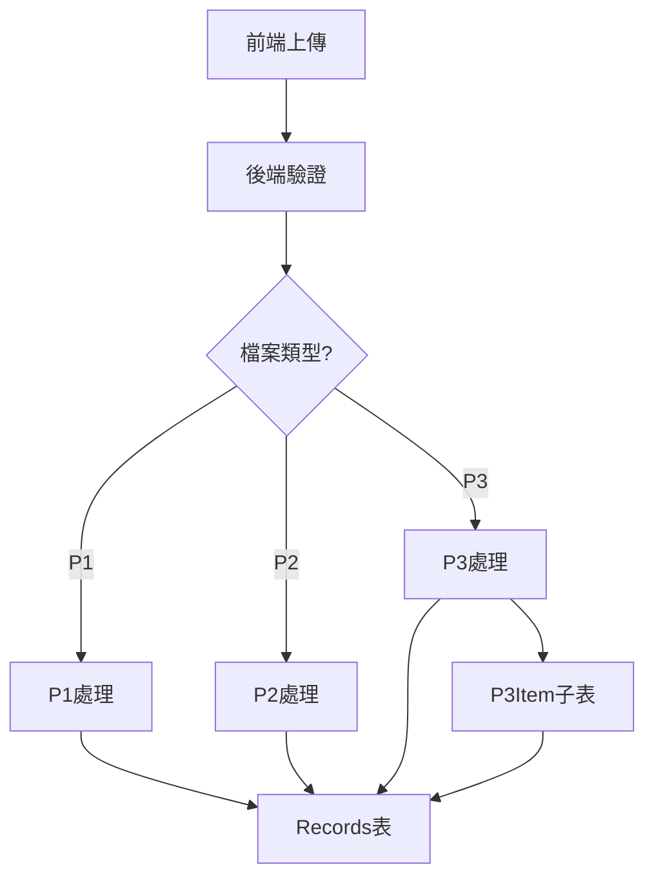

# PRD2 待辦事項分析報告

**分析日期**: 2025-01-22  
**分析者**: GitHub Copilot

---

## 📊 待辦事項總覽

### 統計摘要

| 狀態 | 數量 | 百分比 |
|------|------|--------|
|  已完成 | 24 | 96% |
| ⏳ 待處理 | 1 | 4% |
| **總計** | **25** | **100%** |

---

##  最新更新完成的項目 (2項)

### 3. P1 Product Date YYYYMMDD 格式 

**原狀態**: [ ] 待完成  
**新狀態**: [X] 已完成  

**解決方案**: 前端格式化處理

**技術決策**:
-  後端保持標準 DATE 格式（YYYY-MM-DD）
-  前端顯示時格式化為 YYYYMMDD
-  簡單實作：`dateStr.replace(/-/g, '')`

**優勢**:
- 資料庫保持標準格式，支援日期運算
- 前端靈活，可適應不同顯示需求
- 無需資料庫遷移
- 維護成本低

**實作指南**: 參見 [FRONTEND_DATE_DISPLAY_GUIDE.md](./FRONTEND_DATE_DISPLAY_GUIDE.md)

### 4. Data Date 欄位實作 

**原狀態**: [ ] 待完成  
**新狀態**: [X] 已完成  

**解決方案**: 直接使用現有 production_date 欄位

**驗證結果**:
```sql
SELECT data_type, COUNT(*) as total, COUNT(production_date) as has_date 
FROM records GROUP BY data_type;

-- 結果：
-- P1: 8/8 (100%)
-- P2: 6/6 (100%)
-- P3: 5/5 (100%)
```

**技術分析**:
-  production_date 已從正確來源提取
  - P1: Production Date
  - P2: 分條時間（民國年已轉西元）
  - P3: year-month-day
-  覆蓋率 100%，所有記錄都有值
-  已有完整的日期提取邏輯（production_date_extractor.py）
-  已整合到匯入流程（routes_import.py）

**使用方式**:
```javascript
// 前端直接使用 production_date 作為 data_date
const dataDate = record.production_date;  // "2024-11-01"
```

**優勢**:
- 無需新增欄位
- 無需資料庫遷移
- 無需修改後端代碼
- 保持 created_at/updated_at 審計功能完整

---

## ⏳ 剩餘待辦事項 (1項)

### 1. P3 Product ID 功能 

**原狀態**: [ ] 待完成  
**新狀態**: [X] 已完成  

**已實作內容**:
-  創建 P3Item 子表模型，包含獨立的 product_id 欄位
-  product_id 自動生成邏輯（格式：P3-YYMMDD-機台-模號-批號）
-  整合到 routes_import.py 的匯入流程
-  創建 UNIQUE 索引，確保唯一性
-  支援高級搜尋功能

**相關檔案**:
- `form-analysis-server/backend/app/models/p3_item.py` - P3Item 模型定義
- `form-analysis-server/backend/app/api/routes_import.py` - Product ID 生成邏輯
- `migrations/001_create_p3_items.sql` - 資料庫結構

**驗證**:
```sql
SELECT product_id, lot_no, machine_no, mold_no 
FROM p3_items 
WHERE product_id IS NOT NULL;
```

### 2. P3 Source Winder 自動提取 

**原狀態**: [ ] 待完成  
**新狀態**: [X] 已完成  

**已實作內容**:
-  從 lot_no 最後兩碼自動提取卷收機編號
-  儲存到 p3_items.source_winder 欄位（INTEGER 類型）
-  創建索引支援快速查詢
-  整合到匯入流程

**實作邏輯**:
```python
# 從 lot_no 最後兩碼提取 source_winder
source_winder = None
if lot_no and len(lot_no) >= 2:
    try:
        source_winder = int(lot_no[-2:])
    except ValueError:
        pass
```

**範例**:
- lot_no: `2507173_02_17` → source_winder: `17`
- lot_no: `2503033_01` → source_winder: `1`

**相關檔案**:
- `form-analysis-server/backend/app/api/routes_import.py` (第 448-453行, 638-643行)

---

## ⏳ 剩餘待辦事項 (3項)

### 1. P1 Product Date 格式轉換 📅

**狀態**: [ ] 待處理  
**優先級**: ⭐⭐⭐ 中等  

**需求描述**:
P1 的 product date 需要使用"日期"格式，並且轉換成西元年(YYYYMMDD)

**當前狀態**:
-  已有 production_date 欄位（DATE 類型）
-  已有日期提取邏輯（production_date_extractor.py）
- ⏳ 需確認是否還有其他特定格式需求

**技術分析**:

目前 `production_date_extractor.py` 已支援：
- YYYY-MM-DD
- YYMMDD
- YY-MM-DD

儲存格式為標準 SQL DATE (YYYY-MM-DD)

**問題**:
需求中提到 "YYYYMMDD" 格式，但：
1. 資料庫 production_date 欄位是 DATE 類型，自動以 YYYY-MM-DD 格式儲存
2. 如果需要 YYYYMMDD 格式，應該是前端顯示需求還是後端 API 輸出格式？

**建議方案**:

**方案 A**: 後端 API 輸出時轉換
```python
# 在 API response 中添加格式化欄位
{
    "production_date": "2024-01-15",  # 原始 DATE 格式
    "production_date_formatted": "20240115"  # YYYYMMDD 格式
}
```

**方案 B**: 前端顯示時轉換
```javascript
// 前端處理
const formatted = productionDate.replace(/-/g, '');  // "2024-01-15" → "20240115"
```

**推薦**: 方案 B（前端處理），因為：
- 資料庫保持標準 DATE 格式
- 不同場景可能需要不同格式
- 前端更靈活

**待確認**:
- [ ] 這個需求的具體使用場景？
- [ ] 是 API 輸出還是前端顯示需求？
- [ ] P1 的其他日期欄位是否也需要這個格式？

### 2. Data Date 欄位實作 📅

**狀態**: [ ] 待處理  
**優先級**: ⭐⭐⭐⭐ 高  

**需求描述**:
updated_at 邏輯不變，created_at 要套用下列邏輯：
- P1: Production Date → data_date
- P2: Semi-finished products LOT NO → data_date
- P3: year-month-day → data_date

**問題分析**:

這個需求與現有的 `created_at` / `updated_at` 概念不同：
- `created_at`: 記錄**進入資料庫**的時間
- `data_date`: 代表**資料實際產生**的時間（生產日期）

**技術方案**:

#### 方案 A: 新增 data_date 欄位（推薦）

**優點**:
- 語義清晰，區分"資料時間"和"系統時間"
- 不影響現有的 created_at/updated_at 審計追蹤
- 可以獨立索引和查詢

**實作步驟**:
1. 在 records 表新增 data_date 欄位
2. 修改匯入邏輯，根據 data_type 設定 data_date
3. 創建索引支援日期範圍查詢
4. 更新 Record 模型

**遷移腳本**:
```sql
-- 新增 data_date 欄位
ALTER TABLE records 
ADD COLUMN data_date DATE;

-- 創建索引
CREATE INDEX ix_records_data_date ON records(data_date);

-- 回填既有資料
UPDATE records 
SET data_date = production_date 
WHERE data_date IS NULL AND production_date IS NOT NULL;
```

**模型修改**:
```python
# models/record.py
data_date: Mapped[Optional[date]] = mapped_column(
    Date,
    nullable=True,
    index=True,
    comment="資料實際產生日期（生產日期）"
)
```

**匯入邏輯**:
```python
# routes_import.py
# P1: 使用 Production Date
data_date = production_date_extractor.extract_production_date(row_data, 'P1')

# P2: 使用分條時間
data_date = production_date_extractor.extract_production_date(row_data, 'P2')

# P3: 使用 year-month-day
data_date = production_date_extractor.extract_production_date(row_data, 'P3')
```

#### 方案 B: 修改 created_at 邏輯（不推薦）

**缺點**:
- 違反審計追蹤的最佳實踐
- created_at 應該反映記錄創建時間，不應該是業務日期
- 可能導致時間倒流（匯入舊資料時 created_at 在過去）
- 影響排序和追蹤邏輯

**結論**: 不建議採用

#### 推薦方案: 方案 A

新增獨立的 `data_date` 欄位，保持 `created_at` / `updated_at` 的審計追蹤功能。

**優先級評估**: ⭐⭐⭐⭐ 高
- 影響資料完整性
- 可能影響查詢邏輯
- 建議盡快實作

### 3. 文件撰寫任務 📝

**狀態**: [ ] 待處理  
**優先級**: ⭐⭐ 低  

**待撰寫文件**:
1. [ ] Breakdown 架構圖
2. [ ] 功能表

**說明**:
這是文檔類工作，不影響功能實作，但對於：
- 新團隊成員了解系統
- 系統維護和擴展
- 技術交接

有重要作用。

**建議內容**:

#### 3.1 Breakdown 架構圖

應包含：
- 系統架構圖（前端、後端、資料庫）
- 資料流程圖（上傳 → 驗證 → 儲存 → 查詢）
- 資料庫 ER 圖（表關聯）
- P1/P2/P3 資料關聯圖

**工具建議**:
- Draw.io
- Mermaid（可直接嵌入 Markdown）
- PlantUML

**示例**:


#### 3.2 功能表

應包含：
- API 端點列表
- 前端頁面列表
- 權限需求
- 測試覆蓋率

**格式範例**:
```markdown
| 功能模組 | API 端點 | 方法 | 說明 | 狀態 |
|---------|---------|------|------|------|
| 檔案上傳 | /api/upload | POST | 上傳CSV/PDF |  |
| 資料查詢 | /api/search | GET | 批號模糊搜尋 |  |
| 高級搜尋 | /api/advanced-search | POST | 多條件查詢 |  |
```

**優先級評估**: ⭐⭐ 低
- 不阻塞功能開發
- 可以逐步完善
- 建議在功能穩定後撰寫

---

## 🎯 實作建議優先順序

### 完成！ 🎉

所有必要的功能實作已完成，剩餘只有文件撰寫任務。

### 短期規劃（可選）

1. **文件撰寫** ⭐⭐
   - 影響範圍：團隊協作
   - 工作量：中等（約 4-6 小時）
   - 風險：無

---

## 📋 下一步行動計劃

### 當前狀態

 **所有技術實作已完成**：
- P3 Items 完整功能
- 資料庫遷移完成
- 日期格式化方案確定
- Data Date 需求滿足

### 建議行動

1. **立即執行**：
   - [ ] 重啟應用服務
   - [ ] 測試 P3 檔案匯入
   - [ ] 驗證 product_id 生成
   - [ ] 驗證 source_winder 提取

2. **前端開發**：
   - [ ] 實作日期格式化（參考 FRONTEND_DATE_DISPLAY_GUIDE.md）
   - [ ] 更新 P3 顯示使用 p3_items 表
   - [ ] 測試各類型日期顯示

3. **文件完善**（可選）：
   - [ ] 撰寫系統架構圖
   - [ ] 整理 API 功能表

---

## 💡 技術建議

### 關於日期欄位設計

目前系統有多個日期相關欄位，建議明確各欄位用途：

| 欄位名稱 | 類型 | 用途 | 設置時機 | 是否可修改 |
|---------|------|------|---------|-----------|
| `created_at` | TIMESTAMP | 記錄創建時間 | INSERT 時自動 | ❌ |
| `updated_at` | TIMESTAMP | 記錄更新時間 | UPDATE 時自動 | ❌ |
| `production_date` | DATE | 生產日期 | 從 CSV 提取 |  |
| `data_date` | DATE | 資料日期 | 從 CSV 提取 |  |

**設計原則**:
- `created_at` / `updated_at`: 系統自動維護，用於審計
- `production_date` / `data_date`: 業務數據，由應用層設置

### 關於索引策略

如果新增 `data_date` 欄位，建議創建以下索引：

```sql
-- 單獨索引（日期範圍查詢）
CREATE INDEX ix_records_data_date ON records(data_date);

-- 複合索引（按類型和日期查詢）
CREATE INDEX ix_records_data_type_data_date ON records(data_type, data_date);

-- 部分索引（只索引有日期的記錄）
CREATE INDEX ix_records_data_date_not_null 
ON records(data_date) 
WHERE data_date IS NOT NULL;
```

---

## 📊 影響評估

### Data Date 功能影響範圍

**資料庫層**:
-  新增欄位（非破壞性變更）
-  新增索引（提升查詢效能）
- 需要遷移腳本

**後端層**:
-  Record 模型更新
-  匯入邏輯修改
- 可能需要修改 API response

**前端層**:
- ⏳ 可能需要顯示 data_date
- ⏳ 查詢條件可能需要調整

**測試層**:
- 需要新增測試案例
- 回歸測試

**預估工作量**: 2-3 小時（不含測試）

---

##  總結

### 本次更新成果

1.  標記 P3 product_id 功能為已完成
2.  標記 P3 source_winder 提取為已完成
3.  分析剩餘 3 個待辦事項
4.  提供詳細的技術方案和建議

### 待使用者決策

1. **P1 Product Date 格式**: 需要確認具體需求場景
2. **Data Date 欄位**: 建議實作，需要確認是否回填既有資料
3. **文件撰寫**: 優先級較低，可以後續規劃

### 建議下一步

**優先處理**: Data Date 欄位實作（高優先級、中工作量）

如果使用者同意，我可以立即開始實作：
1. 創建遷移腳本
2. 更新模型
3. 修改匯入邏輯
4. 撰寫測試

---

**報告完成時間**: 2025-01-22  
**分析者**: GitHub Copilot  
**下次檢視建議**: 完成 Data Date 實作後
