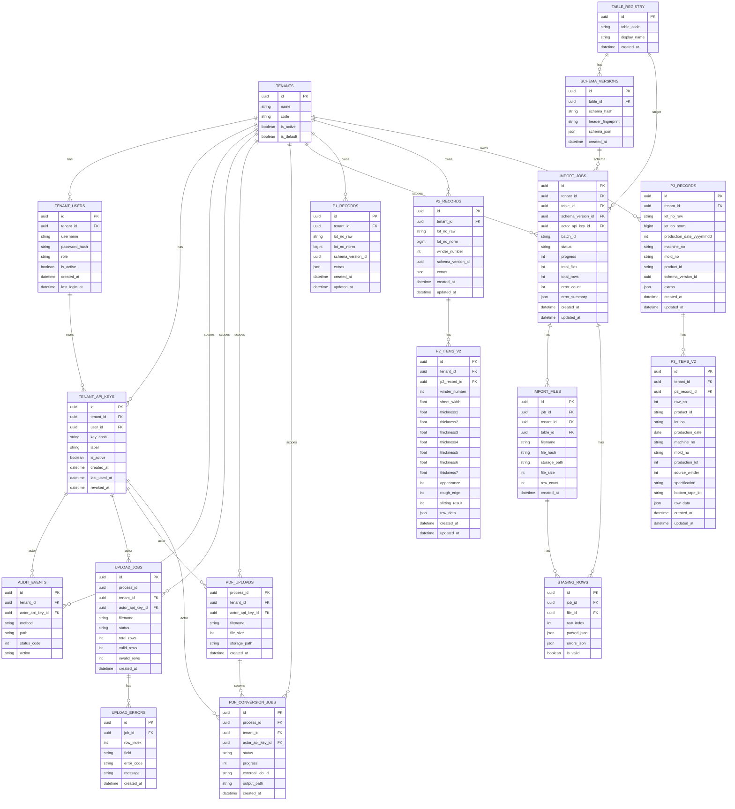

# DB 架構圖（ERD）與資料流

> 目標：用一張圖快速理解「多租戶 tenant」如何貫穿整個 DB，以及各 API 主要讀寫哪些資料表。

## 1) ER Diagram（Mermaid）

## 2) 資料流（API → DB）

- 認證/租戶
  - `/api/auth/login`：讀 `tenants`、`tenant_users`；寫 `tenant_api_keys`（並更新 `tenant_users.last_login_at`）
  - `/api/auth/users*`：CRUD `tenant_users`（本次新增：可改綁定 tenant，並撤銷 `tenant_api_keys`）
  - `/api/tenants*`：CRUD `tenants`

- 上傳/驗證
  - `/api/*upload*`：寫 `upload_jobs`、`upload_errors`；成功後會進入匯入流程（依版本可能寫入 `p1_records/p2_records/p3_records` 與 items）

- V2 匯入管線
  - `/api/v2/import/*`：
    - 控制面：`import_jobs / import_files / staging_rows`
    - schema 管理：`table_registry / schema_versions`
    - commit 後：寫入 `p1_records / p2_records / p2_items_v2 / p3_records / p3_items_v2`

- 查詢/追溯
  - `/api/v2/query/*`：主要讀 `p1_records / p2_records / p2_items_v2 / p3_records / p3_items_v2`（以及部分 legacy 表，若路由仍保留）

- 分析（資料分析頁）
  - `/api/v2/analytics/analyze`：目前回傳範例 JSON；未來預期會讀取上列查詢表，組合查詢結果後交給外部分析套件產生 JSON。

## 3) Multi-tenant 規則（重要）

- 大多數業務 API 都是 tenant-scoped：以 `X-Tenant-Id` 決定資料範圍。
- 若啟用 `AUTH_MODE=api_key`：一般情況 tenant 會綁定在 `X-API-Key`。
- 本次新增：當同時提供有效 `X-Admin-API-Key`（最高級 admin）時，可用 `X-Tenant-Id` 明確指定要查哪個 tenant（跨租戶切換）。
