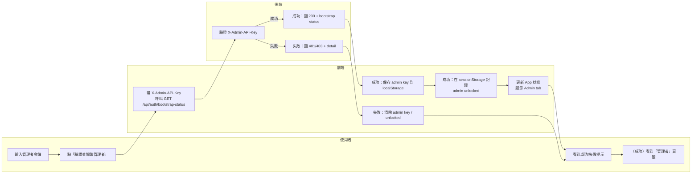
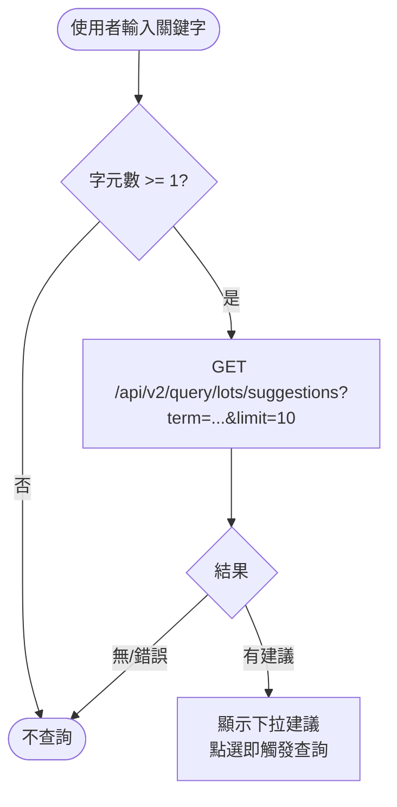

# 使用者流程圖（登入 / 上傳 / 查詢）

本文件提供前端使用者三大操作區塊的「詳細流程圖」：

- 登入（含 tenant 選擇、API key 登入、admin key 解鎖管理者）
- 上傳（CSV 上傳 → 驗證 → 修正 → 匯入）
- 查詢（Lot No / Advanced Query / Traceability）

> 圖表使用 Mermaid。若你的 Markdown 預覽不支援 Mermaid，請改用 GitHub / VS Code Mermaid 外掛預覽。

> 注意：本文件的「上傳」流程圖主要以 legacy UploadPage（`/api/upload*` + `/api/import`）為基礎，僅供理解歷史現況（UploadPage 的 CSV 主流程已於 2026-01-31 切換為 v2 import jobs；圖尚未全面更新）。
> 新的匯入主流程請以 v2 import jobs（`/api/v2/import/jobs`）為準；multi-tenant 模式下 legacy import 端點會回 410。
> 參考：`dev-guides/IMPORT_STRATEGY.md`、`dev-guides/LEGACY_DEPRECATION_PLAN.md`。

---

## 0) 全域前置（共同規則）

```mermaid
flowchart TD
  S([開啟前端]) --> T{是否已選擇 Tenant?}

  T -- 否 --> R[到「登入」頁籤
選擇/設定 Tenant]
  T -- 是 --> K{是否已登入(有 API key)?}

  K -- 否 --> L[到「登入」頁籤
帳密登入取得 API key]
  K -- 是 --> U[可以使用「上傳 / 查詢」]

  %% 備註
  note1[[Tenant 來源：localStorage(TENANT_STORAGE_KEY)
API key 來源：localStorage(API_KEY_STORAGE_KEY) 或 env
全域 fetch wrapper 會對 /api* 自動注入 X-Tenant-Id 與 X-API-Key（/api/auth 與 /api/tenants 例外）]]
  U --- note1
```

---

## 1) 登入（Tenant + API key + Admin key）

### 1.1 登入主流程（使用者視角）

```mermaid
flowchart TD
  A([進入「登入」頁籤]) --> B{localStorage 是否已有 API key?}

  B -- 有 --> B1[顯示已登入狀態
可「更新身分」/「登出」] --> B2{是否需要切換 Tenant?}
  B2 -- 是 --> C[刷新 tenants 列表
選擇某個 Tenant] --> D[保存 Tenant ID 到 localStorage] --> E[完成]
  B2 -- 否 --> E

  B -- 無 --> F[輸入 tenant_code(可空)
username / password] --> G[POST /api/auth/login]
  G --> H{HTTP 200?}
  H -- 否 --> H1[顯示錯誤（toast）] --> A
  H -- 是 --> I[保存 tenant_id / api_key 到 localStorage] --> E
```

### 1.2 初始化 / 管理者解鎖流程（Admin key）

```mermaid
flowchart TD
  A([需要建立第一個 Tenant / Tenant 使用者]) --> B[在「登入」頁籤
輸入管理者金鑰] --> C[GET /api/auth/bootstrap-status
帶 X-Admin-API-Key]
  C --> D{HTTP 200?}

  D -- 否 --> D1[顯示「管理者金鑰無效」
並清除 admin key] --> A

  D -- 是 --> E[保存 admin key 到 localStorage
並在 sessionStorage 記錄「已解鎖管理者」] --> F[前端顯示「管理者」頁籤]
  F --> G[到「管理者」頁籤
建立/管理 Tenant 與使用者]

  note1[[重要：僅「管理者金鑰驗證成功(登入)」後
本次瀏覽器 session 才會顯示管理者頁籤。
一般登入 (API key) 不會顯示管理者頁籤。]]
  G --- note1
```

### 1.3 登入泳道圖（使用者 / 前端 / 後端）

```mermaid
flowchart LR
  %% 泳道：使用者 / 前端 / 後端
  subgraph U[使用者]
    U1[打開「登入」頁籤]
    U2[輸入帳號/密碼\n(tenant_code 可空)]
    U3[點擊「登入」]
    U4[看到登入成功/失敗提示]
  end

  subgraph F[前端]
    F1[組 login payload]
    F2[呼叫 POST /api/auth/login]
    F3[成功：保存 tenant_id / api_key\n到 localStorage]
    F4[顯示 toast + 更新 UI 狀態]
  end

  subgraph B[後端]
    B1[驗證帳密/tenant_code]
    B2[成功：產生 api_key + tenant_id]
    B3[失敗：回應 401/403/422 + detail]
  end

  U1 --> U2 --> U3 --> F1 --> F2 --> B1
  B1 -->|成功| B2 --> F3 --> F4 --> U4
  B1 -->|失敗| B3 --> F4 --> U4
```

### 1.4 管理者解鎖泳道圖（使用者 / 前端 / 後端）



---

## 2) 上傳（CSV Upload / Validate / Fix / Import）

> 對應文件：dev-guides/USER_UPLOAD_FLOW.md

> 注意：以下流程圖以「現況主流程」為準（UploadPage CSV 已於 2026-01-31 切換為 v2 import jobs）。
> - PDF 流程仍走 `/api/upload/pdf*`。
> - legacy `/api/upload`、`/api/import` 僅供相容性/回溯，請勿用於新腳本。

### 2.1 上傳端到端流程（含錯誤修正迴圈）

```mermaid
flowchart TD
  S([到「檔案上傳」頁籤]) --> P{是否已選擇 Tenant?}
  P -- 否 --> P1[阻擋：請先到「登入」頁籤選擇 Tenant] --> S
  P -- 是 --> F[選擇 CSV 檔案(可多檔)]

  F --> V[按「驗證」
POST /api/v2/import/jobs (multipart)]
  V --> R{驗證結果}

  R -- 驗證通過 --> OK[status=READY
顯示可匯入狀態] --> IM[按「匯入」
POST /api/v2/import/jobs/{job_id}/commit]
  IM --> IMR{匯入成功?}
  IMR -- 是 --> DONE([匯入完成 status=COMPLETED])
  IMR -- 否 --> IME[顯示匯入錯誤] --> OK

  R -- 驗證有錯誤 --> ERR[顯示 sample_errors
展開 CSV 表格供修正] --> EDIT[使用者修改表格內容]
  EDIT --> SAVE[按「重新驗證」
POST /api/v2/import/jobs (new job)]
  SAVE --> R2{重新驗證結果}
  R2 -- 仍有錯誤 --> ERR
  R2 -- 通過 --> OK

  R -- 驗證失敗(422/其他) --> E1[顯示錯誤 toast] --> S

  note1[[後端狀態機（v2 import jobs）：
UPLOADED -> PARSING -> VALIDATING -> (READY|FAILED) -> COMMITTING -> (COMPLETED|FAILED)]]
  DONE --- note1
```

### 2.2 例外與保護機制（重要分支）

```mermaid
flowchart TD
  A([任何 /api* 呼叫]) --> B{是否 tenant-scoped API?}
  B -- 是 --> C{是否存在 Tenant ID?}
  C -- 否 --> C1[直接回 400
提示先選擇 Tenant] --> END([停止])
  C -- 是 --> D[自動注入 X-Tenant-Id]

  B -- 否 --> E[不注入 X-Tenant-Id
(例：/api/auth*, /api/tenants*)]

  D --> F{是否有 API key?}
  E --> F
  F -- 有 --> G[自動注入 X-API-Key]
  F -- 無 --> H[不注入 X-API-Key]

  note1[[Admin key 不會被全域自動注入。
只有「管理者」相關呼叫才會在 call site 明確帶入 X-Admin-API-Key。]]
  G --- note1
```

### 2.3 上傳泳道圖（使用者 / 前端 / 後端）

```mermaid
flowchart LR
  subgraph U[使用者]
    U1[進入「檔案上傳」]
    U2[選擇 CSV 檔案]
    U3[點「驗證」]
    U4{是否有錯誤?}
    U5[在表格修正內容]
    U6[點「重新驗證」]
    U7[點「匯入」]
    U8[看到匯入結果]
  end

  subgraph F[前端]
    F1[前端基本檢查\n副檔名/大小/重複檔名]
    F2[POST /api/v2/import/jobs\n(multipart：table_code + files[])]
    F3[GET /api/v2/import/jobs/{job_id}/errors\n顯示錯誤列 + 展開可編輯表格]
    F4[重新驗證：以目前畫面 CSV 內容重建檔案\n再呼叫 POST /api/v2/import/jobs（new job）]
    F5[POST /api/v2/import/jobs/{job_id}/commit]
    F6[toast + 更新檔案狀態]
  end

  subgraph B[後端]
    B1[建立 import_jobs\n保存檔案到暫存目錄]
    B2[背景 parse+validate\n寫入 staging_rows/errors]
    B3[回傳 job_id + 統計 + status]
    B5[commit：整批交易寫入\nrecords/items_v2 等正式表]
    B6[更新 import_jobs.status\nREADY/COMMITTING/COMPLETED/FAILED]
  end

  U1 --> U2 --> F1
  F1 --> U3 --> F2 --> B1 --> B2 --> B6 --> B3 --> F6
  F6 --> U4
  U4 -- 有錯誤 --> F3 --> U5 --> U6 --> F4 --> F2
  U4 -- 無錯誤 --> U7 --> F5 --> B5 --> B6 --> F6 --> U8
```

---

## 3) 查詢（Lot No / Advanced / Traceability）

> 對應文件：dev-guides/USER_QUERY_FLOW.md

### 3.1 查詢主流程（依輸入型態分流）

```mermaid
flowchart TD
  S([到「資料查詢」頁籤]) --> P{是否已選擇 Tenant?}
  P -- 否 --> P1[阻擋：請先到「登入」頁籤選擇 Tenant] --> S
  P -- 是 --> I[輸入關鍵字]

  I --> T{是否符合 Product ID 格式?}

  T -- 是 --> TR[Traceability 查詢
GET /api/traceability/product/{product_id}] --> TRR{結果}
  TRR -- 200 --> TRS[顯示追溯結果（P1/P2/P3/關聯）]
  TRR -- 404 --> TR0[提示：查無此產品]
  TRR -- 其他錯誤 --> TRE[提示：查詢失敗]

  T -- 否 --> Q[Lot No 查詢
GET /api/v2/query/records?lot_no=...&page=...]
  Q --> QR{結果}
  QR -- 200 且有 records --> QS[顯示列表 + 分頁]
  QR -- 200 但空 --> QE[顯示空結果]
  QR -- 非 200/例外 --> QX[顯示錯誤]
```

### 3.2 進階查詢（Advanced Search）

```mermaid
flowchart TD
  S([展開 Advanced Search 面板]) --> O[平行載入選項
GET /api/v2/query/options/*]
  O --> F[填寫條件
(至少一個條件)]
  F --> V{是否至少填一個?}
  V -- 否 --> V1[提示：請至少填寫一個搜尋條件] --> F
  V -- 是 --> Q[GET /api/v2/query/records/advanced?...] --> R{結果}
  R -- 200 --> R1[顯示 records + 分頁/統計]
  R -- 非 200/例外 --> R2[顯示錯誤]
```

### 3.3 搜尋建議（Suggestions）



### 3.4 查詢泳道圖（使用者 / 前端 / 後端）

```mermaid
flowchart LR
  subgraph U[使用者]
    U1[進入「資料查詢」]
    U2[輸入 Lot No 或 Product ID]
    U3[點「查詢」或選擇建議]
    U4[查看查詢結果/錯誤提示]
    U5[（可選）展開 Advanced Search]
    U6[填條件後按「搜尋」]
  end

  subgraph F[前端]
    F0[判斷輸入型態\nProduct ID vs Lot No]
    F1[Lot No：GET /api/v2/query/records]
    F2[Product ID：GET /api/traceability/product/{id}]
    F3[Advanced：載 options\nGET /api/v2/query/options/*]
    F4[Advanced：GET /api/v2/query/records/advanced]
    F5[更新 results/pagination\n顯示 Loading/Empty/Error]
  end

  subgraph B[後端]
    B1[V2 Query：依條件查 records]
    B2[Traceability：查 product 關聯]
    B3[Options：回傳下拉選項]
  end

  U1 --> U2 --> U3 --> F0
  F0 -->|Lot No| F1 --> B1 --> F5 --> U4
  F0 -->|Product ID| F2 --> B2 --> F5 --> U4

  U5 --> F3 --> B3 --> F5
  U6 --> F4 --> B1 --> F5 --> U4
```

---

## 4) 文件對照

- 上傳：dev-guides/USER_UPLOAD_FLOW.md
- 查詢：dev-guides/USER_QUERY_FLOW.md
- 初始化/多租戶/管理者：dev-guides/TENANT_INIT_ADMIN_GUIDE.md
