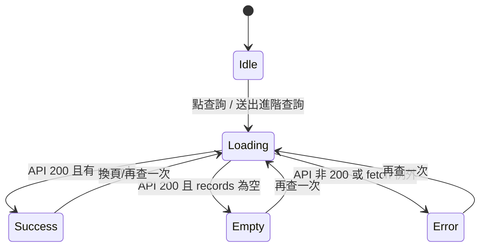

# 使用者查詢流程（Query / Advanced Query / Traceability）

本文件描述「使用者在前端查詢頁進行查詢」的主要路徑：

- **批號查詢（Lot No）**：`GET /api/v2/query/records`
- **進階查詢**：`GET /api/v2/query/records/advanced` + options
- **追溯查詢（Product ID / P3 關聯查詢）**：`/api/traceability/*`

並補充前端 UI 提示與驗證策略。

---

## 1) 使用者視角流程（QueryPage.tsx）

### 1.1 入口與互動

查詢頁提供兩種主要入口：

1. **基本查詢輸入框**
   - placeholder：`輸入 Lot No(批號) 或 Product ID 查詢`
   - 支援搜尋建議（suggestions）
2. **進階查詢面板**（Advanced Search）
   - 可用多條件（lot_no、日期範圍、machine/mold、specification、winder、data_type 等）

### 1.2 前端 UI 狀態機（查詢狀態）

QueryPage 主要用 `loading` 表示查詢狀態：

- `idle`（概念狀態）：尚未查詢或已重置
- `loading = true`：查詢中
  - 按鈕文字會顯示：`查詢中...`
  - 結果區會顯示：`載入中...`
- `loading = false`：查詢完成（成功/空結果/錯誤）

概念轉移：

---

## 2) 批號查詢（Lot No）

### 2.1 基本查詢：`GET /api/v2/query/records`

前端行為：

- 使用者輸入關鍵字（非 Product ID）後按「查詢」
- 前端組參數：`lot_no=<keyword>&page=<n>&page_size=50`
- 呼叫：`/api/v2/query/records?{params}`
- 取得回應後更新：`records`、`total_count`、`page`

回應格式（摘要）：

- `total_count`：符合條件的總筆數
- `records[]`：每筆包含 `data_type`、`lot_no`、`additional_data` 等
- 對 P1/P2/P3：前端會從 `additional_data.rows` 取出原始列，並做欄位格式化（boolean、日期等）

### 2.2 搜尋建議：`GET /api/v2/query/lots/suggestions`

前端行為：

- 使用者輸入時觸發（`term=<keyword>&limit=10`）
- suggestionLoading 期間會顯示：`載入建議中...`
- 點擊建議項目會直接觸發查詢

---

## 3) 進階查詢（Advanced Search）

### 3.1 進階查詢：`GET /api/v2/query/records/advanced`

前端行為：

- 使用者在 Advanced Search 面板填入條件後按「搜尋」
- 前端會做基本驗證：**至少填一個條件**，否則 `alert('請至少填寫一個搜尋條件')`
- lot_no 會做簡單正規化：把空白轉 `_`（例：`2507313 02` → `2507313_02`）
- 日期欄位：若只填起日/迄日其中一個，另一個會自動補成同一天
- 呼叫：`/api/v2/query/records/advanced?{params}`

### 3.2 進階選項載入：`GET /api/v2/query/options/*`

當面板展開時，會平行呼叫以下選項 API：

- `/api/v2/query/options/machine_no`
- `/api/v2/query/options/mold_no`
- `/api/v2/query/options/specification`
- `/api/v2/query/options/winder_number`

---

## 4) 追溯查詢（Traceability）

QueryPage 另有兩種追溯查詢路徑（與批號查詢分開）：

### 4.1 Product ID 查詢：`GET /api/traceability/product/{product_id}`

- 若輸入符合 Product ID 形式（`^\d{8}_.+_.+_.+`），前端不走 lot_no 查詢
- 失敗行為：
  - 404：`alert('查無此產品')`
  - 其他：`alert(\`查詢失敗: ...\`)`

### 4.2 P3 關聯查詢：`GET /api/traceability/winder/{lot_no}/{winder_number}`

使用情境：使用者在 P3 的某一列按「關聯查詢」，前端會嘗試從該列資料解析：

- `baseLotNo`：優先由 `P3_No.` 或 `lot no` 拆解
- `sourceWinder`：由 `P3_No.` 倒數第二段或 `lot no` 最後一段推斷

若解析不到會提示：
- `alert('無法取得批號資訊')`
- 或 `alert('無法從 P3 資料中提取卷收機編號 (Winder Number)...')`

---

## 5) 驗證過程（建議驗證清單）

### 5.1 UI 驗證

1. 基本查詢：輸入已存在的 lot_no（例如 `2507173_01`）→ 應看到 records + total_count
2. 搜尋建議：輸入 1~2 個字元 → 應看到 `載入建議中...`，並出現下拉建議
3. 進階查詢：只按搜尋不填條件 → 應跳出 `請至少填寫一個搜尋條件`
4. Product ID 查詢：輸入符合格式的 Product ID
   - 有資料：應顯示追溯區塊
   - 無資料：應看到 `查無此產品`
5. P3 關聯查詢：在 P3 rows 點「查詢」
   - 若 P3_No 格式正確：應能查到對應 P2/P1

### 5.2 API / Script 驗證

- 以 `/api/v2/query/records` 驗證不同 `data_type` 的回傳格式（特別是 `additional_data.rows`）
- 以 `/api/v2/query/records/advanced` 驗證多條件組合

若要回歸測試，可使用 form-analysis-server 內的 PowerShell 腳本：

- `test-query-v2-trace.ps1`
- `test-api.ps1`（或同系列腳本）
