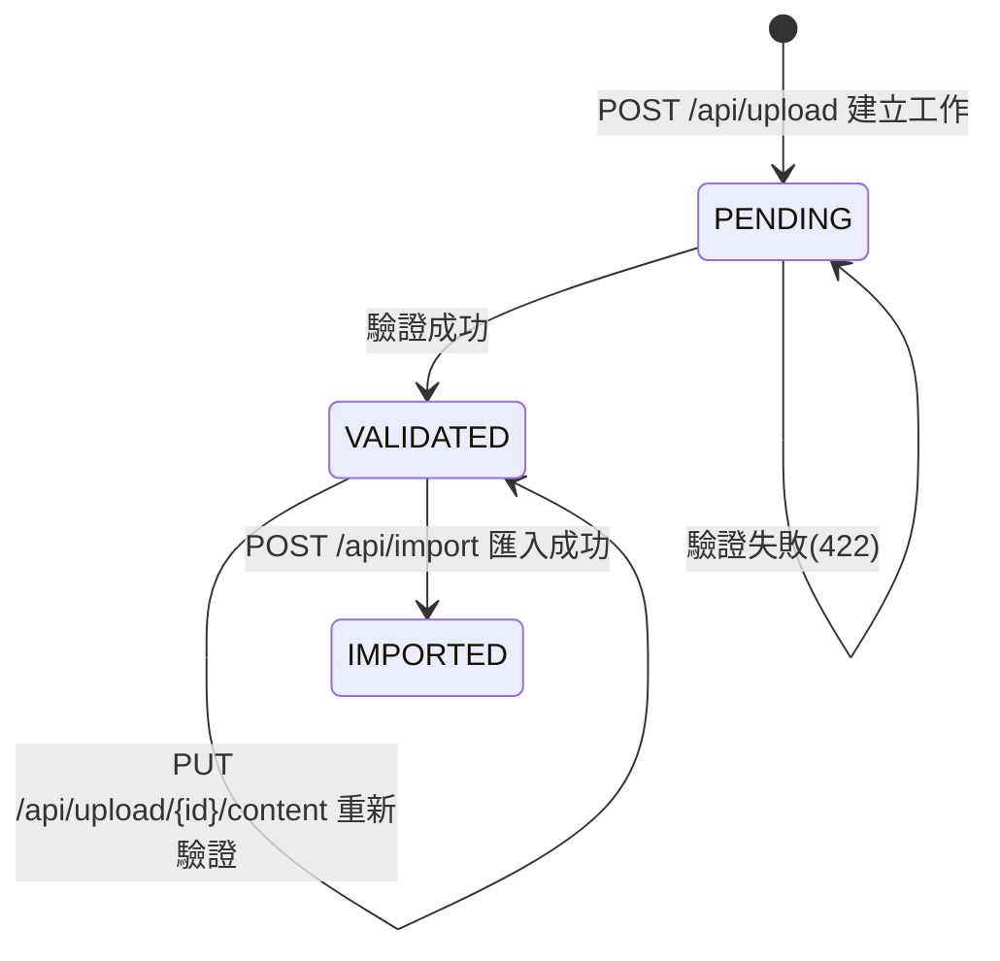
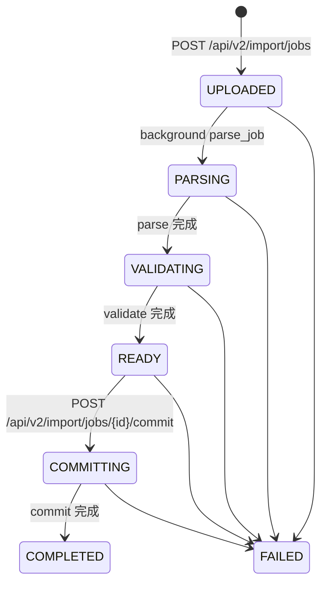

# 使用者上傳流程（Upload / Validate / Import）

本文件描述「使用者在前端上傳 CSV → 驗證 → 修正 → 匯入」的端到端流程，並補充系統內兩套狀態機：

- **Legacy 上傳/匯入（目前 UploadPage UI 使用）**：`/api/upload`、`/api/upload/{process_id}/content`、`/api/import`
- **V2 批次匯入（後端 Import Job 引擎 / scripts 使用）**：`/api/v2/import/jobs`、`/api/v2/import/jobs/{id}/commit`

> 文件目的：讓前後端在「狀態機變化」「UI 提示」「驗證與重試策略」有一致語言。

---

## 1) 使用者視角流程（目前前端 UploadPage.tsx）

### 1.1 流程概覽

1. 使用者在「上傳頁」選擇 CSV 檔案（可多檔）
2. 前端做基本檢查：副檔名、大小、重複檔名
3. 使用者按「驗證」：前端 `POST /api/upload`（multipart）
4. 後端完成驗證後回傳：`process_id` + 行數統計 + `sample_errors`
5. 前端顯示：驗證結果 toast、錯誤摘要、展開可編輯表格
6. 若有錯誤：使用者在表格修正後按「儲存修改」→ `PUT /api/upload/{process_id}/content`（後端會重新驗證）
7. 驗證通過後使用者按「匯入」或「批次匯入」→ `POST /api/import`

### 1.2 前端 UI 狀態機（UploadPage 的檔案狀態）

前端在每個檔案上維護狀態（`UploadedFile.status`）：

- `uploaded`：已加入列表（本地）
- `validating`：驗證中（進度條 10%→100%）
- `validated`：驗證完成（可看到 `sample_errors`、可編輯 CSV）
- `importing`：匯入中（進度條 10%→100%）
- `imported`：匯入完成（稍後會從列表移除）

### 1.3 後端狀態機（Legacy：upload_jobs.job_status_enum）

Legacy 上傳工作（`upload_jobs`）狀態（`JobStatus`）：

- `PENDING`：剛建立或驗證失敗（尚未能匯入）
- `VALIDATED`：驗證完成（可匯入）
- `IMPORTED`：已匯入（不可重複匯入同一工作）

狀態轉移（概念圖）：

---

## 2) 後端 API 與資料流（Legacy UI 對應）

### 2.1 檔案上傳與驗證：`POST /api/upload`

- Request：`multipart/form-data`，欄位 `file`
- 後端行為（摘要）：
  - 建立 `upload_jobs`（狀態 `PENDING`）並保存 `file_content`
  - 執行檔案驗證（含 lot_no 格式、尾端空白列忽略等）
  - 成功：更新工作狀態為 `VALIDATED`、寫入 `upload_errors`、回傳統計與 `sample_errors`
  - 失敗：回 422，工作維持/回到 `PENDING`

前端對應的 UI 提示（節選）：
- 不支援檔案類型：`僅支援 csv 檔案類型`
- 檔案太大：`檔案大小超過 10MB 限制`
- 驗證成功：`${檔名} 驗證完成：共 N 行全部有效`
- 驗證含錯誤：
  - info：`${檔名} 驗證完成：共 N 行，有效 A 行，無效 B 行`
  - error：列出前 3 筆錯誤摘要 + 引導「展開檔案查看完整錯誤列表並修正後按『儲存修改』（會重新驗證）」

### 2.2 使用者修正後重驗證：`PUT /api/upload/{process_id}/content`

- 目的：讓前端表格修改「真的生效」，避免重新上傳原始檔覆蓋使用者修改
- Request：JSON `{ "csv_text": "..." }`
- 後端行為（摘要）：
  - 寫回 `upload_jobs.file_content`
  - 清除舊 `upload_errors`
  - 重新跑驗證
  - 回傳最新統計與 `sample_errors`

前端對應的 UI 提示：
- 未驗證就儲存：`缺少 process_id，請先驗證檔案後再儲存修改`
- 儲存後仍有錯誤：`修改已儲存，但仍有 X 行無效，請繼續修正`
- 儲存且通過：`修改已儲存，且驗證通過`

### 2.3 匯入：`POST /api/import`

- Request：JSON `{ "process_id": "..." }`
- 前置條件：對應的 `upload_jobs.status` 必須是 `VALIDATED`
- 後端行為（摘要）：
  - 重新讀取 `upload_jobs.file_content`
  - 解析 CSV → 寫入 `records`（與相關明細表，例如 P3 items）
  - 更新 `upload_jobs.status = IMPORTED`

前端「批次匯入」行為（摘要）：
- 多檔時：會**跳過**仍有驗證錯誤的檔案，只匯入「已驗證且 `sample_errors` 為空」的檔案
- 若有檔案未驗證/仍有錯誤：會用 toast 阻止匯入並提示原因

---

## 3) V2 批次匯入狀態機（ImportJobStatus，供 scripts / 未來 UI 使用）

V2 匯入工作（`import_jobs`）狀態（`ImportJobStatus`）：

- `UPLOADED`：建立 Job、檔案已上傳到暫存資料夾
- `PARSING`：背景解析 CSV，寫入 `staging_rows`
- `VALIDATING`：背景驗證 staging rows
- `READY`：驗證完成，可提交 commit
- `COMMITTING`：提交中（寫入正式表，例如 records + P2/P3 items）
- `COMPLETED`：提交成功
- `FAILED`：背景流程或提交失敗
- `CANCELLED`：取消（若有實作）

狀態轉移（概念圖）：

> 註：V2 在背景任務發生例外時會把 job 標記為 `FAILED`（避免 UI/監控顯示卡住）。

---

## 4) 驗證過程（建議驗證清單）

### 4.1 UI 驗證（建議操作）

1. 進入 Upload 頁，選擇 1~3 個 CSV
2. 應看到 toast：`已加入 N 個檔案`
3. 點「驗證」
   - 成功：看到 success/info toast + 可展開表格
   - 失敗：看到 error toast（例如 lot_no 格式錯誤）
4. 若有錯誤：在表格修正後點「儲存修改」
   - 仍有錯誤：toast 會提示仍有 `invalid_rows`
   - 通過：toast 顯示 `修改已儲存，且驗證通過`
5. 點「匯入」或「批次匯入」
   - 成功：toast 顯示匯入筆數，已匯入檔案會從列表移除

### 4.2 API 驗證（不用開 UI）

- 驗證：`POST /api/upload`（multipart）
- 查驗證結果（完整錯誤分頁）：`GET /api/validate?process_id=...`
- 重驗證：`PUT /api/upload/{process_id}/content`
- 匯入：`POST /api/import`

若要回歸測試，可參考 form-analysis-server 內的 PowerShell 測試腳本（例如 `test-api.ps1` 系列）。
