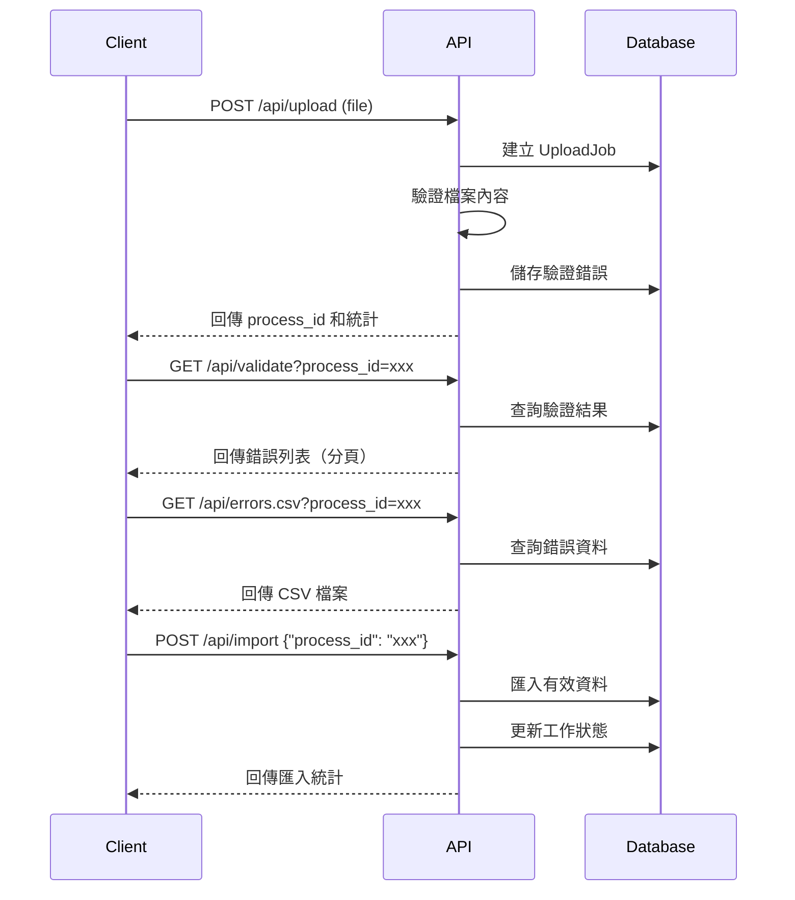

# Form Analysis API

一個基於 FastAPI 的檔案上傳、驗證和資料匯入系統，專為 CSV 和 Excel 檔案處理而設計。

## 功能特色

-  **檔案上傳**：支援 CSV (UTF-8) 和 Excel (.xlsx) 格式
-  **即時驗證**：完整的資料格式和內容驗證
-  **錯誤分析**：詳細的驗證錯誤報告和統計
- 💾 **資料匯入**：將驗證通過的資料匯入系統
-  **錯誤匯出**：匯出錯誤清單為 CSV 格式
-  **狀態追蹤**：完整的處理流程狀態管理

## 技術架構

- **後端框架**：FastAPI + SQLAlchemy (Async)
- **資料庫**：SQLite (開發) / PostgreSQL (生產)
- **檔案處理**：pandas + openpyxl
- **API 文檔**：自動生成 OpenAPI/Swagger 文檔
- **資料驗證**：Pydantic v2 模型

## 快速開始

### 1. 環境設置

```bash
# 切換到後端目錄
cd form-analysis-server/backend

# 安裝依賴
pip install -r requirements.txt

# 啟動伺服器
python app/main.py
```

### 2. 訪問 API 文檔

```
http://localhost:8000/docs
```

## 簡易身份驗證（API Key，tenant 綁定）

在沒有 Nginx / Cloudflare / Front Door 的情況下，可用此模式建立最小可用的「阻擋掃描/濫用」門檻。

### 啟用

設定環境變數：

- `AUTH_MODE=api_key`
- `AUTH_API_KEY_HEADER=X-API-Key`（可選，預設就是 `X-API-Key`）
- `AUTH_PROTECT_PREFIXES=/api`（可選，預設就是 `/api`）
- `AUTH_EXEMPT_PATHS=/healthz,/docs,/redoc,/openapi.json`（可選；當 `AUTH_PROTECT_PREFIXES` 設為 `/` 這類「保護所有路徑」時特別重要）

啟用後：

- 只要路徑符合保護前綴（預設 `/api`），就會要求帶 API key。
- `AUTH_EXEMPT_PATHS` 內的路徑前綴會放行（預設包含 `/healthz`、`/docs`、`/redoc`、`/openapi.json`，方便健康檢查與看文件）。
- API key 會綁定 tenant：server 端會用 key 對應到 tenant，並忽略 client 送來的 `X-Tenant-Id`（避免繞過）。

### 建議預設（profiles）

#### Profile A（建議：只保護 API，文件放行）

適用：內網/開發環境，或你只想保護業務 API，不介意 Swagger 文件能被看到。

```env
AUTH_MODE=api_key
AUTH_API_KEY_HEADER=X-API-Key
AUTH_PROTECT_PREFIXES=/api
```

> 註：此 profile 下 `/docs` 並不在 `/api` 前綴內，因此天然不會被保護。

#### Profile B（上線建議：保護所有路徑，文件放行）

適用：你把後端直接曝露到公網，但仍希望保留 `/docs` 方便操作。

```env
AUTH_MODE=api_key
AUTH_API_KEY_HEADER=X-API-Key
AUTH_PROTECT_PREFIXES=/
AUTH_EXEMPT_PATHS=/healthz,/docs,/redoc,/openapi.json
```

#### Profile C（更嚴格：保護所有路徑，文件也要 key）

適用：公網上線且不希望 Swagger/OpenAPI 被未授權的人看到。

```env
AUTH_MODE=api_key
AUTH_API_KEY_HEADER=X-API-Key
AUTH_PROTECT_PREFIXES=/
AUTH_EXEMPT_PATHS=/healthz
```

### 建立第一把 key（bootstrap）

PowerShell：

```powershell
..\scripts\bootstrap-api-key.ps1 -TenantCode ut -Label "local-dev"
```

或直接跑 Python：

```bash
python scripts/bootstrap_tenant_api_key.py --tenant-code ut --label local-dev
```

指令會輸出 raw key（只會顯示一次，請自行保存）。

### 呼叫範例

```bash
curl -H "X-API-Key: <your-key>" http://localhost:8000/api/tenants
```

## 稽核事件落庫（audit_events，最小版）

此功能用來把「重要操作」寫入 DB，方便日後用 SQL 回查：誰（哪把 API key）在什麼時間呼叫了哪個 API、回應狀態碼是什麼。

特性：

- Best-effort：寫入失敗不會影響 API 回應。
- 不會儲存 request body、也不會記錄明文 API key。
- 預設只記錄寫入類 HTTP 方法（可設定）。

### 啟用

設定環境變數：

- `AUDIT_EVENTS_ENABLED=true`
- `AUDIT_EVENTS_METHODS=POST,PUT,PATCH,DELETE`（可選；預設就是這組）

啟用後會寫入資料表 `audit_events`，內容包含：

- `tenant_id`、`actor_api_key_id`、`actor_label_snapshot`
- `request_id`、`method`、`path`、`status_code`
- `client_host`、`user_agent`
- `created_at`、`metadata_json`（目前包含 query params）

### 驗證（最小操作清單）

目標：打一個「寫入類」API（POST/PUT/PATCH/DELETE），拿到回應的 `X-Request-ID`，再用 SQL 依 `request_id` 查到對應的 `audit_events`（含 tenant/actor）。

1) 設定環境變數並重啟後端

- `AUDIT_EVENTS_ENABLED=true`
- （可選）`AUDIT_EVENTS_METHODS=POST,PUT,PATCH,DELETE`

2)（建議）同時開啟 API key auth，讓 audit_events 具備 actor 欄位

- `AUTH_MODE=api_key`
- 先用本 README 上方的 bootstrap 指令建立一把 API key（會輸出 raw key，只顯示一次）

3) 打一個最小寫入 API：`POST /api/tenants`

備註：如果你已經有 tenant，這個 API 可能回 `409`；不影響驗證，audit 仍會記錄 method/path/status_code。

PowerShell 範例（取出 request_id）：

```powershell
$rawKey = "<your-raw-key>"
$resp = Invoke-WebRequest -Method Post -Uri "http://localhost:8000/api/tenants" -Headers @{ "X-API-Key" = $rawKey } -ContentType "application/json" -Body "{}"
$requestId = $resp.Headers["X-Request-ID"]
$requestId
```

4) 用 SQL 依 request_id 查 `audit_events`

PostgreSQL：

```sql
SELECT
  id,
  created_at,
  tenant_id,
  actor_api_key_id,
  actor_label_snapshot,
  request_id,
  method,
  path,
  status_code
FROM audit_events
WHERE request_id = '<X-Request-ID>'
ORDER BY created_at DESC;
```

（快速看最近幾筆）

```sql
SELECT created_at, request_id, method, path, status_code, tenant_id, actor_api_key_id
FROM audit_events
ORDER BY created_at DESC
LIMIT 20;
```

## API 端點

### 檔案上傳

**POST** `/api/upload`

上傳 CSV 或 Excel 檔案進行驗證。

```bash
curl -X POST "http://localhost:8000/api/upload" \
     -H "accept: application/json" \
     -H "Content-Type: multipart/form-data" \
     -F "file=@your-file.csv"
```

**回應範例：**
```json
{
  "message": "檔案上傳成功",
  "process_id": "550e8400-e29b-41d4-a716-446655440000",
  "total_rows": 100,
  "valid_rows": 85,
  "invalid_rows": 15,
  "sample_errors": [
    {
      "row_index": 5,
      "field": "lot_no",
      "error_code": "INVALID_FORMAT",
      "message": "批號格式錯誤，應為7位數字_2位數字格式"
    }
  ]
}
```

### 查詢上傳狀態

**GET** `/api/upload/{process_id}/status`

查詢上傳工作的處理狀態。

```bash
curl -X GET "http://localhost:8000/api/upload/550e8400-e29b-41d4-a716-446655440000/status"
```

**回應範例：**
```json
{
  "process_id": "550e8400-e29b-41d4-a716-446655440000",
  "status": "VALIDATED",
  "created_at": "2024-01-01T10:30:00Z",
  "message": "檔案驗證完成"
}
```

### 查詢驗證結果

**GET** `/api/validate`

查詢詳細的驗證結果和錯誤列表（支援分頁）。

```bash
# 基本查詢
curl -X GET "http://localhost:8000/api/validate?process_id=550e8400-e29b-41d4-a716-446655440000"

# 分頁查詢
curl -X GET "http://localhost:8000/api/validate?process_id=550e8400-e29b-41d4-a716-446655440000&page=2&page_size=10"
```

**回應範例：**
```json
{
  "job_id": "550e8400-e29b-41d4-a716-446655440000",
  "process_id": "6ba7b810-9dad-11d1-80b4-00c04fd430c8",
  "filename": "product_data.csv",
  "status": "VALIDATED",
  "created_at": "2024-01-01T10:30:00Z",
  "statistics": {
    "total_rows": 100,
    "valid_rows": 85,
    "invalid_rows": 15
  },
  "errors": [
    {
      "row_index": 5,
      "field": "lot_no",
      "error_code": "INVALID_FORMAT",
      "message": "批號格式錯誤，應為7位數字_2位數字格式，實際值：123456_01"
    }
  ],
  "pagination": {
    "page": 1,
    "page_size": 20,
    "total_errors": 15,
    "total_pages": 1,
    "has_next": false,
    "has_prev": false
  }
}
```

### 匯入驗證通過的資料

**POST** `/api/import`

將驗證通過的有效資料匯入到系統中。

```bash
curl -X POST "http://localhost:8000/api/import" \
     -H "Content-Type: application/json" \
     -d '{"process_id": "550e8400-e29b-41d4-a716-446655440000"}'
```

**回應範例：**
```json
{
  "imported_rows": 85,
  "skipped_rows": 15,
  "elapsed_ms": 1250,
  "message": "資料匯入完成：成功 85 筆，跳過 15 筆",
  "process_id": "550e8400-e29b-41d4-a716-446655440000"
}
```

### 匯出錯誤資料 CSV

**GET** `/api/errors.csv`

下載驗證錯誤的詳細清單 CSV 檔案。

```bash
# 下載錯誤 CSV 檔案
curl -o errors.csv "http://localhost:8000/api/errors.csv?process_id=550e8400-e29b-41d4-a716-446655440000"

# 使用 wget 下載
wget -O errors.csv "http://localhost:8000/api/errors.csv?process_id=550e8400-e29b-41d4-a716-446655440000"
```

**CSV 檔案內容範例：**
```csv
row_index,field,error_code,message
5,lot_no,INVALID_FORMAT,批號格式錯誤，應為7位數字_2位數字格式，實際值：123456_01
8,product_name,REQUIRED_FIELD,產品名稱不能為空
12,quantity,INVALID_VALUE,數量必須為非負整數，實際值：-50
15,production_date,INVALID_FORMAT,生產日期格式錯誤，應為YYYY-MM-DD格式，實際值：2024/01/15
```

## 資料格式要求

### CSV/Excel 檔案格式

檔案必須包含以下欄位（標題行）：

| 欄位名稱 | 格式要求 | 範例 | 說明 |
|---------|---------|------|------|
| `lot_no` | 7位數字_2位數字 | `1234567_01` | 批號格式 |
| `product_name` | 1-100字元，非空 | `測試產品A` | 產品名稱 |
| `quantity` | 非負整數 | `100` | 數量 |
| `production_date` | YYYY-MM-DD | `2024-01-01` | 生產日期 |

### 驗證規則

- **lot_no**: 必須符合 `^\d{7}_\d{2}$` 格式
- **product_name**: 不可為空，長度 1-100 字元
- **quantity**: 必須為非負整數
- **production_date**: 必須為有效的 YYYY-MM-DD 日期格式

## 錯誤程式碼說明

| 錯誤程式碼 | 說明 | 範例訊息 |
|---------|------|---------|
| `INVALID_FORMAT` | 格式不正確 | 批號格式錯誤，應為7位數字_2位數字格式 |
| `REQUIRED_FIELD` | 必填欄位為空 | 產品名稱不能為空 |
| `INVALID_VALUE` | 值不符合規範 | 數量必須為非負整數 |
| `OUT_OF_RANGE` | 超出允許範圍 | 產品名稱長度不可超過100字元 |

## 完整工作流程



## 開發和測試

### 執行測試

```bash
# 功能測試
python test_upload_functionality.py

# API 整合測試
python test_validate_api.py

# 匯入匯出測試
python test_import_export_api.py
```

### 啟動開發伺服器

```bash
# 開發模式啟動（自動重載）
python app/main.py

# 或使用 uvicorn
uvicorn app.main:app --reload --port 8000
```

### 資料庫遷移

```bash
# 產生遷移檔案
alembic revision --autogenerate -m "描述"

# 執行遷移
alembic upgrade head
```

## 配置設定

### 環境變數

在 `.env` 檔案中設定：

```env
# 資料庫設定
DATABASE_URL=sqlite+aiosqlite:///./dev_test.db

# API 設定
API_HOST=0.0.0.0
API_PORT=8000

# 檔案上傳設定
MAX_UPLOAD_SIZE_MB=10
UPLOAD_TEMP_DIR=./uploads

# 其他設定
DEBUG=true
LOG_LEVEL=INFO
```

## 生產部署

### Docker 部署

```bash
# 建構映像
docker build -t form-analysis-api .

# 執行容器
docker run -p 8000:8000 -e DATABASE_URL="your-db-url" form-analysis-api
```

### 系統需求

- Python 3.11+
- 記憶體: 最少 512MB
- 儲存空間: 根據檔案上傳量調整
- 資料庫: SQLite (開發) / PostgreSQL 12+ (生產)

## 支援和貢獻

### 常見問題

**Q: 支援哪些檔案格式？**
A: 目前支援 CSV (UTF-8 編碼) 和 Excel (.xlsx) 格式。

**Q: 檔案大小限制是多少？**
A: 預設限制為 10MB，可在設定中調整。

**Q: 如何處理大量資料？**
A: 系統支援分頁查詢和批次處理，適合處理大量資料。

### 技術支援

- API 文檔：`http://localhost:8000/docs`
- 問題回報：建立 Issue
- 功能建議：歡迎提交 Pull Request

---

© 2024 Form Analysis System. All rights reserved.