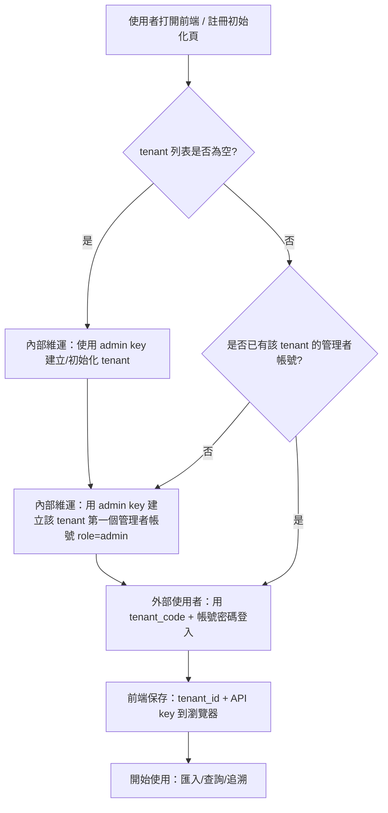
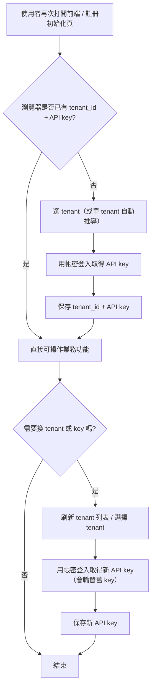

# 第一次使用：初始化 / 登入（外部上線版）

這份文件是給**第一次接觸這套系統**的人使用。

在前端看到的「註冊 / 初始化」頁面，目的分成兩件事：

- 讓系統知道你要操作哪一個「工作區」（Tenant）
- 如果公司有開啟「通行碼（API key）」保護：用「帳號/密碼」登入取得通行碼

完成後，你就能正常進行匯入、查詢、追溯等功能。

---

## 流程圖 1：初次初始化 / 註冊流程（第一次上線、資料庫全新）



## 流程圖 2：再次進入註冊/初始化頁（已使用過、日常）



---

## 需要知道的 3 個名詞

### 1) Tenant（工作區 / 場域）是什麼？

可以把 Tenant 想成「**不同工廠 / 不同客戶 / 不同專案**的資料分區」。

- 選錯 Tenant，就會看到別的區的資料（或看到空的）
- 所以第一次進系統要先「建立或選擇」正確的 Tenant

### 2) API key（通行碼）是什麼？

有些環境會要求通行碼，避免外人亂連線。

- 不需要理解技術細節
- 只需要知道：它就是你的「登入後通行證」，貼上後才能操作 API

### 3) admin key 是什麼？（只給內部維運）

admin key 是「初始化 / 緊急復原」用的最高權限金鑰（break-glass）。

- 原則上**不提供給外部使用者**
- 只用在：第一次建立場域、第一次建立該場域的管理者帳號、或緊急救援

---

## 0) 先確認系統已啟動

請先打開這兩個網址確認能看到畫面：

- 前端（操作畫面）：http://localhost:18003
- 後端（API 文件，通常不用管）：http://localhost:18002/docs

如果前端打不開，請先回到快速啟動文件：getting-started/QUICK_START.md

---

## 1) 用前端「註冊 / 初始化」頁完成場域（Tenant）設定（推薦）

1. 打開前端：http://localhost:18003
2. 找到並進入「註冊 / 初始化」頁籤

會看到「快速開始（建立/選擇場域）」與「場域（Tenant）初始化 / 選擇」。接下來依你看到的狀況操作：

### 情況 A：列表顯示「沒有任何 Tenant」或是空的

代表這是一個全新的資料庫（第一次使用很常見）。

外部上線情境下，通常由**內部維運**先做一次初始化（可能需要 admin key）。初始化完成後，外部使用者只需要登入即可。

1. 按下「一鍵建立/選擇場域」
2. 等待出現成功訊息
3. 再按一次「刷新 tenants 列表」
4. 確認列表裡出現一筆 Tenant，並顯示「已選擇 / 已啟用」之類的狀態

完成後通常就可以開始使用系統。

### 情況 B：列表中只有 1 個場域（Tenant）

系統通常會自動選取它。

- 如果畫面顯示已選取，就可以直接開始使用
- 如果沒有，請點選那一筆，按「使用 / 保存」之類的按鈕

### 情況 C：列表中有多個場域（Tenant）

這表示同一套系統有多個工作區。

1. 先問清楚你應該使用哪一個（通常看名稱或代碼）
2. 在列表中點選正確那一筆
3. 按「使用 / 保存」

---

## 2) 用「帳號/密碼」登入取得通行碼（API key）（推薦）

如果你操作功能時顯示「401 未授權 / Unauthorized」，通常代表環境已開啟通行碼保護。

操作方式：

1. 回到「註冊 / 初始化」頁面
2. 按「展開進階設定」
3. 在「帳號/密碼登入」區塊輸入：
  - tenant_code（場域代碼，通常是你負責的區/場區代碼）
  - username / password
4. 按「登入並取得 API key」
5. 登入成功後，系統會把 API key 保存到瀏覽器（之後就不用每次貼）

小提醒：如果你換電腦或清掉瀏覽器資料，需要再登入一次。

## 3) 建立新帳號：不需要把 admin key 給外部

日常新增帳號建議走「場域管理者（role=admin）」權限：

- 外部使用者不需要知道 admin key
- 由該場域的管理者登入後，在「建立帳號」區塊新增使用者

第一次的「場域管理者帳號」如果還不存在，才需要由**內部維運**用 admin key 建立第一個管理者（bootstrap）。

---

## 常見問題（照著做就能排除）

### 看到「需要提供 X-Tenant-Id」或類似訊息

意思是：系統不知道你要用哪個工作區。

請回到「註冊 / 初始化」頁：

1. 按「刷新 tenants 列表」
2. 確認有選到一個 Tenant（情況 A/B/C）
3. 重新整理頁面再試一次

### 看到「401 未授權 / Unauthorized」

意思是：這個環境有開通行碼保護，但你尚未登入取得通行碼。

請照本文件第 2 節用帳密登入。

### 我明明選了 Tenant，但還是看不到資料

可能原因：

- 你選錯 Tenant（請確認名稱/代碼）
- 這個 Tenant 目前還沒有匯入任何資料

你可以先去匯入一份測試檔，或請管理者確認你應該用的 Tenant。

---

## 進階（給工程師 / 維運）

如果需要用 API 或環境變數做自動化設定，請看下面（一般使用者可以忽略）。

### Tenant（後端規則）

- 後端會用 `X-Tenant-Id` header（或 API key 綁定 tenant）決定目前工作區

### API key（簡易防護）

- 若後端啟用 `AUTH_MODE=api_key`，受保護 API 需要 `X-API-Key`
- key 會綁定 tenant：啟用後，server 會以 key 推導 tenant，並忽略 client 提供的 `X-Tenant-Id`

### 用 API 手動建立 tenant

- `GET /api/tenants`
- `POST /api/tenants`

Body 範例：

```json
{
  "name": "UT",
  "code": "ut",
  "is_default": true,
  "is_active": true
}
```

### 建立第一把 API key（bootstrap）

PowerShell（在 form-analysis-server 目錄下）：

```powershell
python .\backend\scripts\bootstrap_tenant_api_key.py --tenant-code ut --label local-dev
```

### 建立第一個管理者帳號（bootstrap / break-glass）

如果該 tenant 還沒有任何管理者帳號，內部維運可用 admin key 呼叫：

- `POST /api/auth/users`

注意：這是 break-glass 行為，原則上不提供給外部。
